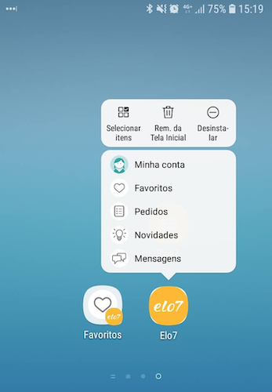

## Menos passos para atingir um objetivo

Prover menos passos para um objetivo facilita o fluxo de navegação e gera mais conversão para seu produto. O *App Shortcuts* é uma funcionalidade disponibilizada a partir do Android Nougat (7.0), o objetivo é facilitar o acesso às principais telas do aplicativo a partir de seu ícone no menu ou área de trabalho, basta segura-lo por alguns segundos para que os atalhos para as telas correspondentes apareçam. Nosso foco com esse artigo é explicar de forma prática como aplicamos esse conceito nos aplicativos do Elo7.

## Tipos de atalho

Existem duas formas de implementar os atalhos: estática e dinâmica. Na estática, apenas definimos um arquivo XML contendo para cada representação de atalho, um título, imagem e uma intenção para a tela correspondente. Na forma dinâmica, a qual focaremos aqui, podemos inserir e excluir atalhos conforme ações do usuário ou novas notificações. Aqui no Elo7 por exemplo, criamos atalhos dinamicamente conforme novas mensagens chegam aos nossos compradores ou vendedores. Assim como resultado, mostramos uma lista de telas que nossos usuários mais tem chances de querer acessar.



### A fábrica de atalhos

Vamos exemplificar aqui a classe responsável pela criação de todos os atalhos. O desafio que enfrentamos nela foi fazer chamadas assíncronas para requisitar os dados a serem apresentados. A estrutura do método criador que iremos mostrar possui duas chamadas: uma para obter os atalhos e outra para construí-los requisitando seus ícones.

```java
    private final ShortcutManager shortcutManager;

    public void create() {

        // Chamada para API.
        shortcutClient.getShortcuts(new ShortcutClient.ShortcutsCallback() {

            // Sucesso do callback do client, retornando o objeto representado pelo modelo ShortcutsResultModel.
            @Override
            public void onSuccess(ShortcutsResultModel shortcutsResultModel) {

                // Prepara atalhos para construção

                List<ShortcutsResultModel.ShortcutModel> shortcuts = shortcutsResultModel.getShortcuts();

                for (ShortcutsResultModel.ShortcutModel shortcutModel :
                        shortcuts.subList(0, Math.min(shortcutManager.getMaxShortcutCountPerActivity(), shortcuts.size()))) {

                    createShortcutBuilder(shortcutModel);
                    shortcutModelList.add(shortcutModel);
                }

                setIconsAndBuildShortcuts(new SetIconsAndBuildShortcutsCallback() {

                    // Constroi após retorno dos ícones

                }
            }

        }
    }
```

Em nosso exemplo, o *client* possui um método `getShortcuts` que recebe um novo callback como parâmetro. Se você não tem muita experiência com chamadas à APIs, recomendo estudar a biblioteca Retrofit, que é a que utilizamos para fazer requisições REST. No sucesso do callback, obtemos o modelo `ShortcutsResultModel`. Detalharemos esse modelo posteriormente nesse post.

A partir do Array de atalhos, pegamos os primeiros resultados e passamos como parâmetro para o método `createShortcutBuilder`, que irá preparar o construtor do atalho para posteriormente ser possível adinioná-lo no app. O método `getMaxShortcutCountPerActivity` do `ShortcutManager`, retorna a quantidade de atalhos suportadas pelo sistema, que atualmente estão entre quatro e cinco.

### Modelo

A estrutura do JSON que a API retorna, é semelhante a mostrada abaixo:

```json

    {
        "shortcuts":
            [
                {
                    "image": "https://example.com/image.png",
                    "title": "Tela Exemplo",
                    "destino": "ClasseDestino"
                }
            ]
    }

```

Podemos utilizar o seguinte modelo para implementá-lo:

```java
public class ShortcutsResultModel implements Serializable {

    @SerializedName("shortcuts")
    private ShortcutListModel shortcutList;

    public List<ShortcutModel> getShortcuts() {
        return shortcutList.getShortcuts();
    }

    private class ShortcutListModel {
        @SerializedName("shortcuts")
        private List<ShortcutModel> shortcuts;

        //Geter
    }

    public class ShortcutModel {
        @SerializedName("image")
        private String image;

        @SerializedName("title")
        private String title;

        @SerializedName("destino")
        private String destino;

        // Geters
    }

}

```

### Preparando os contrutores dos atalhos

Um dos problemas que enfrentamos ao inserir uma imagem remota nos atalhos, é o fato de não podermos inseri-las após adicionarmos os atalhos no APP. Como alternativa, podemos criar uma lista de *Builders* para que possamos adicioná-los somente após termos todos os ícones. Abaixo, um exemplo do método `createShortcutBuilder`, que será chamado para cada atalho que será disponibilizado:

```java

private void createShortcutBuilder(ShortcutsResultModel.ShortcutModel shortcutModel) {

    ShortcutInfo.Builder shortcutBilder = new ShortcutInfo.Builder(context, shortcutId)
            .setShortLabel(shortcutModel.getTitle())
            .setLongLabel(shortcutModel.getTitle())
            .setIntent(new Intent(Intent.ACTION_VIEW, null, context, getActivityByName(shortcutModel.getDestino())));

    builderList.add(shortcutBilder);
}

private Class<? extends Activity> getActivityByName(String activity) throws ClassNotFoundException {
    Class<? extends Activity> activityClass = (Class<? extends Activity>) this.getClassLoader().loadClass(activity);
    return activityClass;
}

```

Após a criação dos construtores, podemos seguir para o próximo passo, que é a obtenção das imagens dos atalhos. Para isso, vamos criar o método `setIconsAndBuildShortcuts`.

```java

private void setIconsAndBuildShortcuts(final SetIconsAndBuildShortcutsCallback callback) {
    int shortcutModelListIndex = 0;

    for (final ShortcutInfo.Builder builder :
            builderList) {

        ShortcutsResultModel.ShortcutModel shortcutModel = shortcutModelList.get(shortcutModelListIndex);
        shortcutModelListIndex++;

        ImageRequest imageRequest = ImageRequest.fromUri(shortcutModel.getImage() != null ? shortcutModel.getImage() : "");
        ImagePipeline imagePipeline = Fresco.getImagePipeline();
        DataSource<CloseableReference<CloseableImage>> dataSource = imagePipeline.fetchDecodedImage(imageRequest, null);

        dataSource.subscribe(
                new BaseBitmapDataSubscriber() {

                    @Override
                    protected void onNewResultImpl(Bitmap bitmap) {
                        callback.onSuccess(builder, bitmap);
                    }

                    @Override
                    protected void onFailureImpl(DataSource<CloseableReference<CloseableImage>> dataSource) {
                        numberOfCallbackCalls ++;
                    }

                },
                UiThreadImmediateExecutorService.getInstance());
    }

}

private interface SetIconsAndBuildShortcutsCallback {
    void onSuccess(ShortcutInfo.Builder builderToSetIcon, Bitmap bitmap);
}

```

Nesse método, percorremos a lista de construtores e para cada elemento, fazemos uma requisição utilizando a biblioteca Fresco para obter o ícone correspondente. Para cada resposta bem sucedida, chamamos o callback que irá continuar o fluxo no método `create`. A seguir continuaremos a implementá-lo.

### Finalizando a construção

Vamos agora finalizar a construção do método `create` que começamos a exemplificar no começo desse post. Nele implementaremos o sucesso do callback do método `setIconsAndBuildShortcuts`.

```java

numberOfCallbackCalls = 0;

// Código omitido

setIconsAndBuildShortcuts(new SetIconsAndBuildShortcutsCallback() {

    @Override
    public void onSuccess(ShortcutInfo.Builder builderToSetIcon, Bitmap bitmap) {
        builderToSetIcon.setIcon(Icon.createWithBitmap(bitmap, SHORTCUT_PIXELS_RADIUS));

        numberOfCallbackCalls ++;

        if (builderList.size() == numberOfCallbackCalls) {
            List<ShortcutInfo> shortcutInfoList = new ArrayList<>();

            for (ShortcutInfo.Builder builder :
                    builderList) {
                shortcutInfoList.add(builder.build());
            }

            shortcutManager.addDynamicShortcuts(shortcutInfoList);
        }
    }
}

```

Aqui começamos inicializando a variável global `numberOfCallbackCalls`. Essa variável é responsável por contar quantas vezes chamamos o callback, para dessa maneira, saber se já atribuímos todos os ícones e a partir daí, construir e finalmente adicionar os atalhos no APP.

Para adicionar os atalhos, criamos uma lista local adicionando os objetos de atalhos dessa vez já construídos. Essa lista será usada como parâmetro do método `addDynamicShortcuts` do `ShortcutManager`, que por sua vez, é responsável por adicionar os atalhos.

## Chamando o método criador

Uma dica para disponibilizar o método `create` de forma mais simples, é usar o Dagger para injetar a classe que o implementa em qualquer outra do seu código. Crie um construtor passando os elementos que você precisará para, por exemplo, utilizar o `ShortcutManager` e o *client*. Exemplo:

```java

public ShortcutsFactory(Context context, ShortcutClient shortcutClient) {
    this.context = context;
    this.shortcutClient = shortcutClient;
    this.shortcutManager = context.getSystemService(ShortcutManager.class);
}

```

Injete o `ShortcutFactory` nos locais onde deseja utilizá-lo:

```java

@Inject
ShortcutsFactory shortcutsFactory;

//Código omitido

if (Build.VERSION.SDK_INT >= Build.VERSION_CODES.N_MR1) {
    shortcutsFactory.create();
}

```

Caso não esteja familiarizado com o Dagger e queira saber mais, temos um post explicando sobre ele aqui no nosso blog: https://elo7.dev/desmistificando-dagger2/

## Conclusão

A utilização dos atalhos ainda é desconhecida por boa parte dos usuários, porém existe um potencial muito grande em sua utilização. São de fácil implementação e podem trazer um ganho de produtividade para os usuários do seu aplicativo. Enquanto essa funcionalidade não se populariza, cabe ao desenvolvedor que o utiliza o divulgar como funcionalidade de seu produto.
