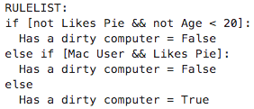
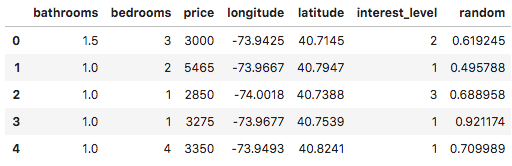
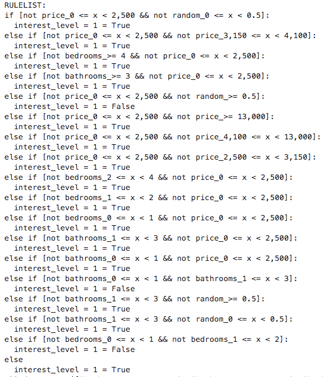
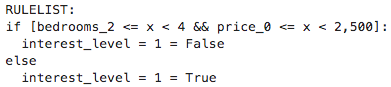

# CORELS: um modelo interpretável

Neste post, vamos falar sobre o algoritmo CORELS (Certifiably Optimal RulE ListS), que promete ser uma opção aos modelos _blackbox_.

## O problema dos modelos _blackbox_

Nos Estados Unidos, há alguns anos atrás, houve uma polêmica envolvendo um modelo _blackbox_ chamado COMPAS, cujo propósito era identificar se um criminoso seria reincidente ou não. Uma análise independente pela organização ProPublica concluiu que réus negros tinham uma chance maior de serem incorretamente rotulados como **alto** risco de reincidência, enquanto os réus brancos tinham uma chance maior de serem incorretamente rotulados como **baixo** risco de reincidência. Isso expôs a existência de um possível viés no modelo de machine learning COMPAS.

Um problema inerente aos modelos _blackbox_, entretanto, é que eles, por natureza, não são totalmente explicáveis. Assim, ao gerar aproximações ao modelo para explicar suas predições, podemos chegar a explicações que não necessariamente usam as mesmas _features_ ou os mesmos cálculos efetivamente utilizados pelo modelo. Essa inescrutabilidade se torna um problema ao utilizá-lo para modelar problemas que envolvem decisões sensíveis em larga escala (como em políticas públicas nas áreas de saúde, segurança, educação etc.).

Nesse sentido, recentemente, foi demonstrado que é possível gerar explicações éticas mesmo para modelos injustos. O método envolve gerar um _ensemble_ de modelos interpretáveis que aproxima um modelo _blackbox_, de forma que os modelos interpretáveis sejam mais justos do que o modelo original em relação a um atributo sensível, de acordo com uma métrica pré-definida. Essa técnica foi chamada de "fairwashing" e sua genericidade evidencia o perigo de confiar cegamente nas explicações de modelos _blackbox_.

## O modelo CORELS

O modelo CORELS tem como objetivo criar uma lista de regras explícitas compostas por afirmações `if-then` que tornam a tomada de decisão do modelo compreensível por seres humanos. Sua estrutura é semelhante às árvores de decisão e por isso dependendo da quantidade de dados iniciais, o número de combinações de regras torna o processo de otimzação um problema NP-completo. Para contornar isso, a criação da sua lista de regras são otimizadas por meio de uma função objetivo composta de um parâmetro de regularização que penaliza listas de regras grandes. Esse modelo é mais genérico do que um modelo de árvores de decisão, pois aplica uma técnica chamada **branch-and-bound** que permite a **poda** dos ramos não otimizados enquanto constrói a árvore, o que reduz o resultado de pesquisa. Um ponto importante que deve ser ressaltado é o fato de que esse modelo não implica causalidade, uma vez que alterações na função objetivo e nas features podem alterar a regra de listas geradas. Abaixo, apresentamos a função objetivo para a lista de regras `LR` que é composta da combinação da _perda_ do modelo, que leva em conta a quantidade de predições erradas geradas pela lista de regras, e  mais o fator de regularização, parâmetro $c$, que penaliza o tamanho da lista de regras:

$objetivo(LR) = perda(LR) + c * len(LR)$


### Exemplo 1:
Como primeiro exemplo, trazemos o exemplo que se encontra na [página do github do Pycorels](https://github.com/fingoldin/pycorels). Suponha que tenhamos uma amostra com 4 pessoas que são identificadas como **usuário de Mac**; **gosta de torta**; **tem menos de 20 anos**, e a ideia seja entender quais regras identificam se o computador do usuário é sujo.

```python
# 4 samples, 3 features
X = [[1, 0, 1], [0, 0, 0], [1, 1, 0], [0, 1, 0]]
y = [1, 0, 0, 1]
# Feature names
features = ["Mac User", "Likes Pie", "Age < 20"]
```

Após definir o conjunto de dados, podemos aplicar o classificador `CorelsClassifier` aos nossos dados. Note que `max_card` controla a quantidade de condições por `if`, $c$ é o parâmetro de regularização e `verbosity` controla o quanto de verbosidade gostaríamos de ver no treinamento. Particularmente, no notebook (usamos o [Jupyter Lab](https://jupyterlab.readthedocs.io/en/stable/index.html)), não vimos diferença em usar o modo `["loud", "samples"]`, mas quando colocamos no `ipython` ou rodamos um script, podemos ver a diferença na quantidade de informações que são impressas no console.

```python
# ["loud", "samples"] is the most verbose setting possible
C = CorelsClassifier(max_card=2, c=0.0, verbosity=["loud", "samples"])

# Fit the model
C.fit(X, y, features=features, prediction_name="Has a dirty computer")

# Print the resulting rulelist
print(C.rl())
```

As regras geradas pelo modelo foram as seguintes: o usuário tem o computador limpo se ele não gosta de torta e tem menos de 20 anos ou se ele usa Mac e gosta de torta, como pode ser visto pela saída do modelo abaixo:



### Exemplo 2:

Como segundo exemplo, usamos o conjunto de dados `rent.csv` do manifesto [Beware Default Random Forest Importances](https://explained.ai/rf-importance/). Como lá, também colocamos uma coluna a mais, `random`, com números aleatórios.

```python
df = pd.read_csv('rent.csv')
df['random'] = np.random.random(size=len(df))
```

Abaixo, veja as 5 primeiras linhas do conjunto de dados:



Para preparar esse conjunto de dados para utilizar no CORELS, precisamos que tanto os dados de entrada como o target sejam binários. Para binarizar o conjunto de entrada utilizamos como parâmetros de cortes das colunas 'bathrooms', 'bedrooms', 'price' os percentis 25%, 50%, 75% e 99%. Além disso, tornamos a coluna de dados aleatórios binária também.

```python
def format_num(num):
    return f'{num:,.2f}'.rstrip('0').rstrip('.')

def generate_interval(bins):
    def _generate_interval(val):
        bin_id = np.digitize(val, bins, right=False)
        return f'{format_num(bins[bin_id-1])} <= x < {format_num(bins[bin_id])}' if bin_id < len(bins) else f'>= {format_num(bins[-1])}'
    return _generate_interval

def create_category_col(df, col, q):
    quantiles = df[col].quantile(q).tolist()
    calc_interval = generate_interval([0] + quantiles)
    return df[col].apply(calc_interval)

def binarize_col(df, col, q=[0.25, 0.5, 0.75, 0.99]):
    df[f'{col}_cat'] = create_category_col(df, col, q)
    return pd.get_dummies(df[f'{col}_cat'], prefix=col)

full_df = pd.DataFrame()
for col in ['bathrooms', 'bedrooms', 'price']:
    full_df = pd.concat([full_df, binarize_col(df, col)], axis=1)
full_df = pd.concat([full_df, binarize_col(df, 'random', q=[0.5])], axis=1)
```

Em seguida, preparamos os inputs do modelo:

```python
train_df, test_df = train_test_split(full_df, stratify=full_df[target_col].values)

X_train = train_df.drop(target_col, 1).values
y_train = train_df[target_col].values

X_test = test_df.drop(target_col, 1).values
y_test = test_df[target_col].values

features = train_df.drop(target_col, 1).columns.tolist()
target_col = 'interest_level = 1'
```

Note que gostaríamos de prever o valor da coluna `interest_level`. Essa coluna têm valores inteiros de 1 a 3. Como a variável a se prever (`target`) também deve ser binária, optamos por classificar, primeiro, os dados em `interest_level = 1` ou `interest_level != 1`. Para conseguir distinguir entre `interest_level = 2` e `interest_level = 3`, poderíamos subsequentemente treinar outro modelo CORELS com essa mudança na variável target.

Lembre-se de que parâmetros com valores diferentes podem levar a listas de regras muito diferentes, por isso, o modelo CORELS não deve ser interpretado como um modelo causal. Para explicar um pouco melhor o efeito do parâmetro de regularização nesse exemplo, fizemos um primeiro teste com o valor de $c=0$, o que significa que não iremos penalizar o tamanho da lista de regras. Note que aqui explicitamente mostramos o valor do parâmetro `policy`, que controla a ordem em que as listas de regras são avaliadas na busca pela **melhor** lista (para mais detalhes, veja a [documentação](https://corels.eecs.harvard.edu/corels/)).

```python
C = CorelsClassifier(max_card=2, c=0., policy='lower_bound', verbosity=["loud", "samples"])
C.fit(X_train, y_train, features=features, prediction_name=target_col)
```



Como vemos acima, não penalizar listas de regras longas realmente produz uma lista bem grande! Além disso, vemos que a feature aleatória aparece em meio às regras! Como melhorar esses pontos?

Para isso, basta especificar um fator de regularização maior que zero. Nesse exemplo, fizemos o teste com $c=0.01$.

```python
C = CorelsClassifier(max_card=2, c=0.001, policy='lower_bound', verbosity=["loud", "samples"])
C.fit(X_train, y_train, features=features, prediction_name=target_col)
```



Podemos ver que a lista de regras está consideravelmente menor. Isso acontece porque, para penalizar listas mais longas, o algoritmo seleciona somente as regras que aumentam a acurácia significativamente. Com isso, a feature aleatória deixa de aparecer nessa lista de regras enxuta e, em relação à acurácia, de fato, a diferença é mínima (`69.83%` vs. `69.80%` no conjunto de teste). Dessa maneira, como listas pequenas de regras permitem um entendimento maior e mais assertivo do comportamento do modelo, vemos que foi bem útil incluir um parâmetro de regularização com valor maior do que zero no treino do CORELS.

## Teste você mesmo!

Além do que foi apresentado acima, no [notebook](https://github.com/cimarieta/corels-examples/blob/master/corels.ipynb) que fizemos, temos resultados de árvores de decisão e o uso combinado do [xgboost](https://xgboost.readthedocs.io/en/latest/) + [SHAP](https://github.com/slundberg/shap) aplicados aos mesmos problemas, que podem ser usados para comparação e melhor entendimento sobre o CORELS.

## Referências

* ANGELINO, Elaine et al. Learning certifiably optimal rule lists for categorical data. **The Journal of Machine Learning Research**, v. 18, n. 1, p. 8753-8830, 2017.

* RUDIN, Cynthia. Stop explaining black box machine learning models for high stakes decisions and use interpretable models instead. **Nature Machine Intelligence**, v. 1, n. 5, p. 206-215, 2019.

* AÏVODJI, Ulrich et al. Fairwashing: the risk of rationalization. **arXiv preprint arXiv:1901.09749**, 2019.
