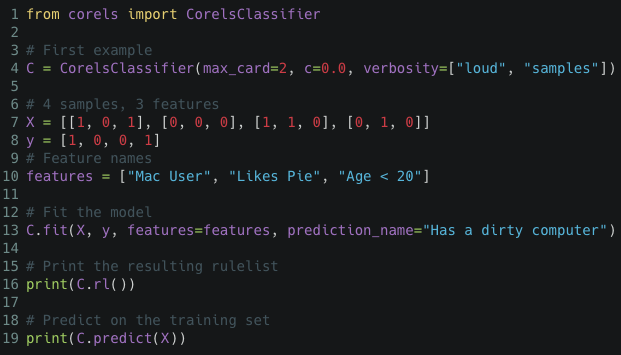
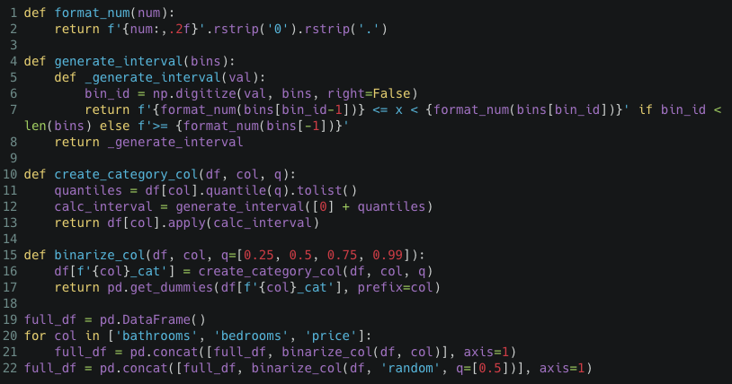
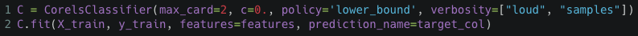
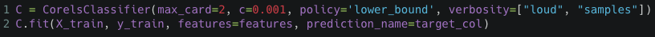

# CORELS: um modelo interpretável
Neste post, vamos falar sobre o algoritmo CORELS (Certifiably Optimal RulE ListS), que promete ser uma opção aos modelos _blackbox_.
## O problema dos modelos _blackbox_
Nos Estados Unidos, alguns anos atrás, houve uma polêmica envolvendo um modelo _blackbox_ chamado COMPAS, cujo propósito é identificar se um criminoso será reincidente ou não. Uma análise independente da organização ProPublica concluiu que réus negros tinham uma chance maior de serem incorretamente rotulados como **alto** risco de reincidência, enquanto os réus brancos tinham uma chance maior de serem incorretamente rotulados com **baixo** risco de reincidência. Isso expôs a existência de um possível viés no modelo de machine learning COMPAS.

## O modelo:

O modelo tem como objetivo criar uma lista de regras explícitas compostas por afirmações `if-then` que tornam a tomada de decisão do modelo compreensível por seres humanos. Sua estrutura é semelhante às árvores de decisão e por isso dependendo da quantidade de dados iniciais o número de combinações de regras torna o processo de otimzação um problema NP-completo. Para contornar isso, a criação da sua lista de regras são otimizadas por meio de uma função objetivo composta de um parâmetro de regularização que penaliza lista de regras grandes. Esse modelo é mais genérico que um modelo de árvores de decisão pois aplica uma técnica chamada **branch-and-bound** que permite a **poda** dos ramos não otimizados enquanto constrói a árvore, o que reduz o resultado de pesquisa. Um ponto importante que deve ser ressaltado é o fato de que esse modelo não implica causalidade uma vez que alterações na função objetivo e nas features podem alterar a regra de listas geradas. Abaixo apresentamos a função `objetivo` para a lista de regras `LR` que é composta da combinação da `perda` do modelo, que conta a quantidade de vezes que ele errou a previsão da regra, e  mais o fator de regularização, parâmetro $\c$, que representa o controle do tamanho da lista de regras:

$objetivo(LR) = perda(LR) + c * len(LR)$

#### Exemplo 1:
Como primeiro exemplo, suponha que temos uma amostra com 4 pessoas que são identificadas como **usuário de Mac**; **gosta de torta**; **tem menos de 20 anos**, e a ideia era entender quais regras identificam se o computador do usuário é sujo.

As regras geradas pelo modelo foram as seguintes: o usuário tem o computador limpo se ele não gosta de torta e tem menos de 20 anos ou se ele usa Mac e gosta de torta, como pode ser visto pela saída do modelo abaixo:

#### Exemplo 2:
Como segundo exemplo usamos o conjunto de dados do manifesto [Beware Default Random Forest Importances](https://explained.ai/rf-importance/).

Segue um exemplo das 5 primeiras linhas do conjunto de dados:

Para preparar esse conjunto de dados para utilizar no CORELS precisamos que tanto os dados de entrada como o target sejam binários. Para binarizar o conjunto de entrada utilizamos como parâmetros de cortes das colunas 'bathrooms', 'bedrooms', 'price' os percentis 25%, 50%, 75% e 99%. Além disso, assim como nos dados originais do manifesto incluímos uma coluna de dados aleatórios que sofreram o mesmo processo de binarização.

 Lembrando que como se trata de um modelo não causal, ajustes diferentes nos parâmetros levam a resultados muito diferentes nas regras criadas. Para explicar um pouco melhor o efeito do parâmetro de regularização nesse exemplo, fizemos um primeiro teste com o valor de $c=0$, o que significa que não iremos penalizar o tamanho da lista de regras:

Por outro lado, ao imprimir um fator de regularização diferente de zero podemos verificar a diferença na quantidade de regras listadas pelo modelo, mesmo com $c=0.01$. Outro ponto importante é verificar que listas pequena de regras permitem um entendimento maior e mais acertivo da aplicação das regras.

