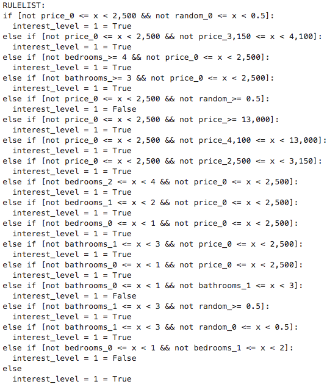

# CORELS: um modelo interpretável
Neste post, vamos falar sobre o algoritmo CORELS (Certifiably Optimal RulE ListS), que promete ser uma opção aos modelos _blackbox_.
## O problema dos modelos _blackbox_
Nos Estados Unidos, alguns anos atrás, houve uma polêmica envolvendo um modelo _blackbox_ chamado COMPAS, cujo propósito é identificar se um criminoso será reincidente ou não. Uma análise independente da organização ProPublica concluiu que réus negros tinham uma chance maior de serem incorretamente rotulados como **alto** risco de reincidência, enquanto os réus brancos tinham uma chance maior de serem incorretamente rotulados com **baixo** risco de reincidência. Isso expôs a existência de um possível viés no modelo de machine learning COMPAS.

## O modelo:

O modelo tem como objetivo criar uma lista de regras. Dependendo da quantidade de dados iniciais a quantidade de combinações ótima de regras torna o modelo de otimzação um problema NP-completo. Essas listas de regras são compostas por  afirmações `if-then` que tornam a estrutura do modelo interpretável uma vez que cada previsão é explicada pela regra resultada do modelo. A criação da sua lista de regras são otimizadas por meio de uma função objetivo composta de um parâmetro de regularização que penaliza lista de regras grandes. Abaixo apresentamos a essa função `objective` na lista de regras `RL` que como podemos ver é composta da combinação da perda do modelo mais o fator de regularização nele o parâmetro $\lambda$ representa o controle do tamanho da lista de regras:

$objective(RL) = loss(RL) + \lambda * len(RL)$

Esse modelo é mais genérico que um modelo de árvore pois aplica uma técnica chamada **branch-and-bound** que permite a `poda` dos ramos não otimizados enquanto constrói a árvore de decisão, o que reduz o resultado de pesquisa.

#### Exemplo 1:
Como primeiro exemplo, suponha que temos uma amostra com 4 pessoas que são identificadas como usuário de Mac; gosta de torta; tem menos de 20 anos, e a ideia era entender quais regras identificam se o computador do usuário é sujo.

As regras geradas pelo modelo foram:

#### Exemplo 2:
Como segundo exemplo usamos o conjunto de dados do manifesto [Beware Default Random Forest Importances](https://explained.ai/rf-importance/).

Segue um exemplo das 5 primeiras linhas do conjunto de dados:

Para preparar esse conjunto de dados para utilizar no CORELS precisamos que tanto os dados de entrada como o target seja binário. Para binarizar o conjunto de entrada utilizamos como parâmetros de cortes das colunas 'bathrooms', 'bedrooms', 'price' os percentis 25%, 50%, 75% e 99%. Além disso, assim como nos dados originais do manifesto incluímos uma coluna de dados aleatórios:

Podemos reparar pelos resultados abaixo que ajustes diferentes nos parâmetros levam a resultados muito diferentes nas regras criadas. O primeiro teste que fizemos foi não penalizar a função objetivo:

Por outro lado, ao imprimir um fator de regularização mesmo que pequeno podemos verificar a diferença na quantidade de regras listadas pelo modelo. Outro ponto importante é verificar que listas pequena de regras permitem um entendimento maior e mais acertivo da aplicação das regras.

