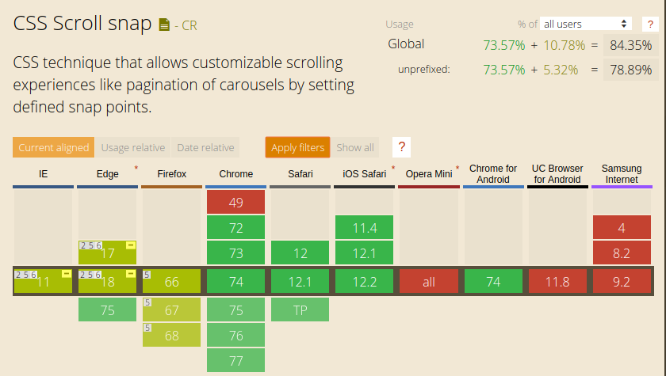

Há algum tempo eu escrevi um post falando sobre o IntersectionObserver e como utiliza-lo para enriquecer um carrossel de fotos, você pode [ler ele aqui](https://elo7.dev/intersection-observer/). Mas ficou faltando uma funcionalidade muito utilizada em carrosséis, o scroll que ajusta as imagens na tela, mostrando ao usuário sempre a imagem posicionada centralizada certinha.

Para conseguir esse efeito existe um modulo em CSS chamado [CSS Scroll Snap](https://developer.mozilla.org/en-US/docs/Web/CSS/CSS_Scroll_Snap) que facilita e muito a implementação deixando a transição de imagens bem fluída e bonita.

Nesse post eu vou mostrar um caso de uso complementando o carrossel ;)

## Funcionamento Básico

Apenas duas propriedades são necessárias para o funcionamento básico, e que neste caso já é o suficiente para o exemplo:

`scroll-snap-type` - Utilizado no container das imagens, essa propriedade é responsável por configurar o comportamento do scroll.

Possíveis valores chave:

- scroll-snap-type: none;
- scroll-snap-type: x;
- scroll-snap-type: y;
- scroll-snap-type: block;
- scroll-snap-type: inline;
- scroll-snap-type: both;

No exemplo abaixo eu mostro as combinações mais utilizadas dessa propriedade, o scroll em linha ou coluna (`x` ou `y`), atrelado ao `mandatory` ou `proximity` que são propriedades opcionais.

<p class="codepen" data-height="450" data-theme-id="0" data-default-tab="result" data-user="alinelee" data-slug-hash="eaeJmm" style="height: 450px; box-sizing: border-box; display: flex; align-items: center; justify-content: center; border: 2px solid; margin: 1em 0; padding: 1em;" data-pen-title="Css Scroll Snap - mandatory x proximity">
  <span>See the Pen <a href="https://codepen.io/alinelee/pen/eaeJmm/">
  Css Scroll Snap - mandatory x proximity</a> by Aline Lee (<a href="https://codepen.io/alinelee">@alinelee</a>)
  on <a href="https://codepen.io">CodePen</a>.</span>
</p>
<script async src="https://static.codepen.io/assets/embed/ei.js"></script>

Observe que no caso em que foi utilizado o `mandatory` a imagem *sempre* fica alinhada com as bordas do carrossel e que no caso do `proximity` apenas quando a imagem foi arrastada e liberada próxima das bordas que ela vai se deslocar automáticamente, possibilitando que o carrossel mostre duas imagens ao mesmo tempo.

No nosso caso como o scroll é no eixo `X` e o comportamento desejado é que as margens das imagens fiquem *sempre* presas às margens da tela iremos utilizar o `scroll-snap-type: x mandatory;`.

`scroll-snap-align` - Propriedade usada nos itens e determina o alinhamento relativo ao container scrollado.

O valores são parecidos com um alinhamento simples:

- scroll-snap-align: none;
- scroll-snap-align: start end;
- scroll-snap-align: center;
- scroll-snap-align: inherit;
- scroll-snap-align: initial;
- scroll-snap-align: unset;

Quando o container é menor que seus filhos e o alinhamento é o `start end` as imagens vão se alinhar dependendo da proximidade com o inicio e o fim.

Neste caso vamos utilizar a propriedade `scroll-snap-align: center` como podemos ver no `CSS`:

```css
.carousel {
  display: flex;
  overflow: auto;
  max-width: 400px;
  margin-left: auto;
  margin-right: auto;
  border: solid 1px #dad5d5;
  border-radius: 3px;
  padding: 0;

  scroll-snap-type: x mandatory;
}

.carousel li {
  display: flex;
  min-width: 400px;
  background-color: #e5e5e5;
  justify-content: center;

  scroll-snap-align: center;
}
```
## scroll-padding

Caso o efeito desejado seja que as imagens scrolladas não colem nas bordas é possível utilizar o `scroll-padding`, de maneira muito similar ao `padding` para delimitar entre a borda e o conteúdo.

## scroll-snap-stop


## Compatibilidade

Infelizmente como acontece com outras implementações de specs CSS, `Css Scroll Snap` é a nova versão do que já foi chamado de `Scroll Snap Points`.

Fora a confusão que fica com os nomes é preciso ter cuidado com browsers que ainda não são compativeis com a nova versão, a situação atual é essa:

[](https://caniuse.com/#feat=css-snappoints)

Esse [artigo do firefox](https://developer.mozilla.org/en-US/docs/Web/CSS/CSS_Scroll_Snap/Browser_compat) pode te ajudar a lidar com as duas versões caso seja necessário ;)


## Conclusão

O scroll da página é algo básico mas extremamente importante, quando mal implementado ele pode estragar totalmente a experiência do usuário.

Utilizar o `Css Scroll Snap` garante uma solução simples e nativa, que evita malabarismos no código e proporciona uma experiência muito fluida para o usuário.

Para se aprofundar mais no assunto você pode consultar a [documentação completa](https://developer.mozilla.org/en-US/docs/Web/CSS/CSS_Scroll_Snap).

Se você ficou com alguma dúvida, ou quer compartilhar a sua experiência fique à vontade para utilizar a caixa de comentários. Obrigada e até a próxima!
