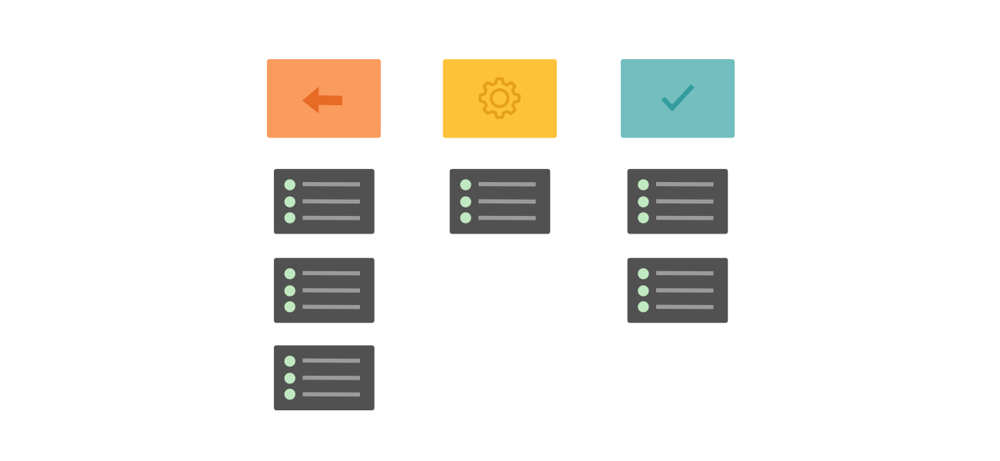

Conheça o trabalho do time de design de produto no Elo7! Vamos apresentar uma visão geral do trabalho deste pequeno, porém orgulhoso time :)

O time de design de produto do Elo7 atua na elaboração de soluções para a interface dos nossos produtos (especialmente o nosso site - o marketplace e o Talk7), bem como a busca da experiência mais agradável possível para os nossos usuários. Atualmente, somos uma equipe enxuta, formada por 3 membros, mas estamos sempre trabalhando em colaboração com outras equipes, tanto de desenvolvimento quanto de produto.

Para que tudo funcione bem, passamos por algumas etapas no nosso dia-a-dia de trabalho, que vou detalhar a seguir.

## Métodos ágeis:

Assim como o time de Engenharia, a equipe de design de produto também segue métodos ágeis. Trabalhamos com ciclos de sprint que duram 2 semanas, planejadas conforme o roadmap de entregas do produto. Nosso objetivo é sempre estar duas sprints à frente do desenvolvimento, ou seja, quando uma nova página ou tela dos aplicativos começa a ser implementada, ela provavelmente foi desenhada cerca de um mês antes.
Esta prática permite que os conceitos discutidos na equipe de produto (e posteriormente desenhados pelo nosso time) tenham tempo de maturação, iterações e, eventualmente, que sejam testados diretamente com os usuários.

## Discussões conceituais
Sempre que detectamos possíveis melhorias para o produto, ou mesmo quando planejamos uma nova funcionalidade, isso é inicialmente discutido com profissionais de várias áreas do Elo7, em uma reunião estratégica semanal. Se decidimos que vamos seguir em frente com a ideia, começamos a esboçar quais telas e casos de uso serão necessários, e colocamos a mão na massa.

## Mockups em alta fidelidade

Sempre trabalhamos com mockups de alta fidelidade, pois, uma vez que os conceitos já foram discutidos previamente quando iniciamos o desenho das páginas, já temos uma boa ideia do que deve ser feito. A princípio, pode parecer que leva mais tempo para criar e iterar um mockup desse tipo; para termos mais agilidade, utilizamos o [Sketch](https://www.sketchapp.com/) para o desenho de interfaces, que nos ajuda a reduzir o tempo de trabalho graças às opções disponíveis na ferramenta (como símbolos e outras comodidades).

Raramente desenhamos apenas uma tela, dando preferência ao desenho do fluxo como um todo, com seus principais casos de uso e decorrências - isso evita o retrabalho em uma mesma funcionalidade, além de nos permitir sempre focar no que está sendo trabalhado no momento.

Normalmente a mesma tarefa precisa de mockups para todas as plataformas - desktop, web mobile, Android e iOS. Procuramos fazer tudo na mesma sprint para não comprometer as datas de lançamento.

## Pesquisas com usuários
Periodicamente, nós realizamos algumas pesquisas com usuários sobre as principais funcionalidades que pretendemos lançar ou melhorar. Essas pesquisas são focadas em *testes de usabilidade*. Escrevemos um roteiro de perguntas, e criamos os protótipos que serão apresentados.

Nossas pesquisas são feitas de forma presencial: ao longo da semana, nossos usuários (cerca de 5 entrevistados) são convidados a visitar o Elo7 e a conversar a respeito das funcionalidades abordadas na pesquisa, fornecendo feedback do que pode ser melhorado no nosso produto. Essa conversa é conduzida pelas perguntas do roteiro (que comentei antes) e interação em protótipos de alta fidelidade, para que o usuário vivencie uma situação quase real de uso.

Após o fim de cada ciclo de pesquisas, juntamos os pontos mais importantes que descobrimos e apresentamos à equipe de produto. Assim, debatemos esses pontos que, no final, geram as ações a serem tomadas nas funcionalidades testadas.

## Conclusão
Esses são os principais pilares da equipe de design de produto do Elo7, mas existem ramos menores que surgem conforme a necessidade do produto. Ao longo dos posts falaremos com mais detalhes sobre cada um desses tópicos e sobre vários outros!

