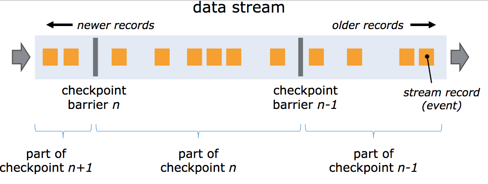
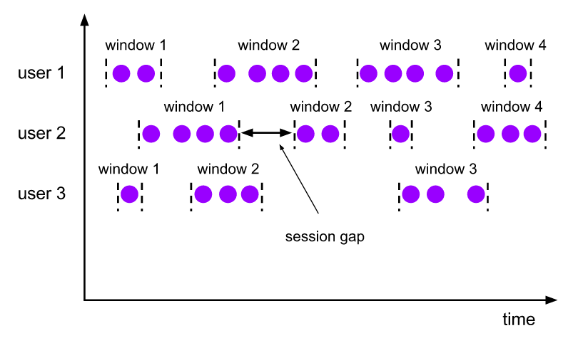
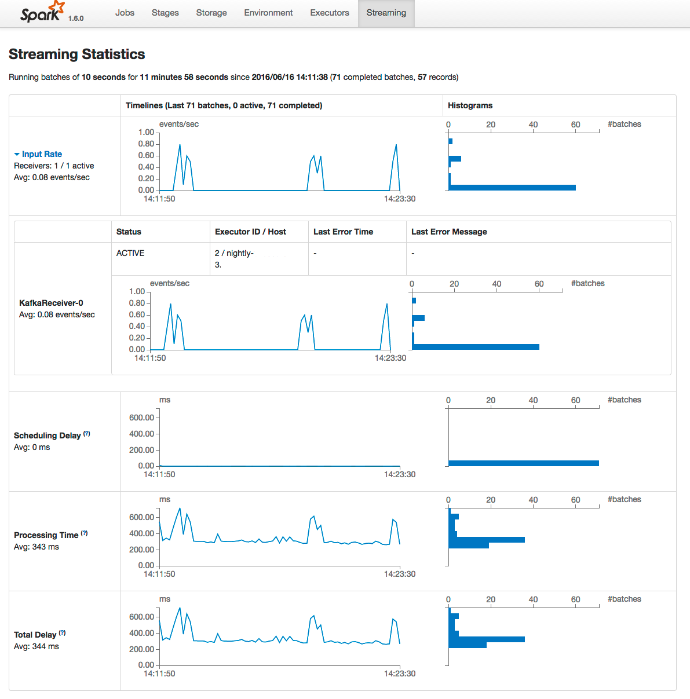

O título do post é polêmico para chamar sua atenção, mas a ideia deste post é mostrar a nossa visão sobre essas duas excelentes ferramentas: [Apache Flink](http://flink.apache.org/) e [Apache Spark](http://spark.apache.org/). Nós não entraremos em detalhes profundos de cada ferramenta, nem faremos qualquer tipo de benchmark. Nós vamos apenas apontar as características que são relevantes para o nosso dia a dia.
Se você não conhece o Flink ou o Spark, na *homepage* dos projetos há uma introdução bacana sobre cada um deles.

## Flink

O Flink é um projeto que nasceu com a mentalidade **streaming-first**, isto é, o objetivo principal da plataforma é processar dados que são produzidos de maneira contínua e infinita:

Essa arquitetura permite que o *job* que processa o *stream* seja mais rápido e resiliente. Mais rápido porque os eventos são processados assim que eles chegam e mais resiliente porque os eventuais picos de eventos (também conhecidos como *back pressure*) são gerenciados de [maneira automática](https://data-artisans.com/blog/how-flink-handles-backpressure) pelo Flink.

No Flink, os *streams* podem ser tratados como finitos ou infinitos. Com isso é possível emular um *stream* usando o *backup* dos dados do [Apache Kafka](https://kafka.apache.org/) e reprocessar o histórico usando **exatamente o mesmo código** implementado sobre a API de *streams*. Isso nos dá o poder de olhar para o passado sempre que for necessário sem nenhum esforço adicional.

As *windows* são uma maneira dividir um *stream* contínuo em pequenos agrupamentos para efetuar algum processamento. Este conceito é relativamente comum em sistemas de processamento contínuo, porém o Flink possui um tipo especial de *window* que é muito útil em cenários do dia a dia chamado **[Session Window](https://ci.apache.org/projects/flink/flink-docs-release-1.3/dev/windows.html#session-windows)**. Com ela é possível agrupar eventos subsequentes cujo o intervalo de tempo entre eles não exceda um determinado valor, criando uma espécie de sessão do usuário:

A garantia **exactly-once** na computação de estado do Flink nos dá a segurança de que os resultados dos *streams* estarão corretos, mesmo em cenários de falha. Como esse estado é persistido utilizando o mecanismo de *[savepoints](https://data-artisans.com/blog/turning-back-time-savepoints)*, é possível fazer o *deploy* de novas versões do *stream* sem perder o estado atual computado.

O ponto fraco do Flink é a sua **comunidade**, que ainda é pequena. Isso faz com que o ecossistema não seja tão rico, o que leva à falta de integrações para outras ferramentas. Por exemplo, para conseguirmos utilizar o Flink na nossa *pipeline*, nós mesmos adicionamos o [suporte para o Elasticsearch 5.x](https://github.com/apache/flink/pull/2767).

## Spark

Já o Spark possui uma mentalidade **batch-first**. Isso acontece porque o projeto foi criado com o propósito de ser mais rápido e eficiente do que o *MapReduce*, principal técnica de processamento na época. Influenciado por essa mentalidade, o Spark Streaming foi criado para resolver o problema de fluxos contínuos utilizando **microbatches**, aproveitando a implementação fundamental de *batches* do Spark (os famosos *RDDs*):

Para nós isso não faz muita diferença, afinal, os dados serão processados de maneira semelhante a um *stream* mesmo com um pouco mais de latência. O problema desta implementação é que o tamanho da *window* e o tamanho do *microbatch* precisam estar muito bem configurados para conseguir sobreviver a um volume de eventos maior do que o esperado. Uma dessas configurações é a ``spark.streaming.backpressure.enabled=true`` que faz com que o Spark analise os tempos de processamentos de *micro-batches* anteriores para se adaptar a flutuações em micro-batches subsequentes.

Falando em **[configuração](https://spark.apache.org/docs/latest/configuration.html)**, o Spark possui diversas, inclusive algumas não documentadas. Isso pode ser uma vantagem ou uma desvantagem: é possível otimizar o Spark para se encaixar com suas necessidades mas, ao mesmo tempo, exigirá mais esforço para dominar tais configurações.

Um dos pontos positivos no Spark é a diversidade de **métricas** e uma interface *web* que mostra muitas informações sobre o estado de um *job*, como tempos de processamento, utilização (ou uso) de memória e disco:

A partir da versão 2.x do Spark, é possível fazer o **deploy de atualizações** do *stream* sem perder o estado atual computado. Nas versões anteriores, todo o código era serializado juntamente com os estados salvos no *[checkpoint](https://spark.apache.org/docs/latest/streaming-programming-guide.html#checkpointing)*, não sendo possível reutilizar o mesmo. Dependendo da sua fonte de dados, será necessário código adicional para lidar com este problema.

Uma das grandes inovações da versão 2.x do Spark foi o **[Structured Streaming](https://spark.apache.org/docs/latest/structured-streaming-programming-guide.html)**, o qual utiliza a mesma API tanto para *batch* quanto para *streams*. Porém esta não é a única vantagem desta nova API, que conta com garantias *exactly-once*, além de diversas otimizações.

Por fim, um dos principais diferenciais do Spark é a sua **comunidade**: desde 2009, mais de 1000 desenvolvedores já contribuíram ao projeto! Essa comunidade faz com que o ecossistema em torno do Spark seja muito rico, especialmente no que se refere a *machine learning* e processamento em *batch*.

## Conclusão

Ambas as ferramentas tem seus pontos positivos e negativos. Aqui no Elo7 nós usamos o Flink na nossa [pipeline analítica](/elo7-analytics-elytics/) mas também utilizamos Spark em alguns projetos internos com a ajuda do [Nightfall](/nightfall/).
