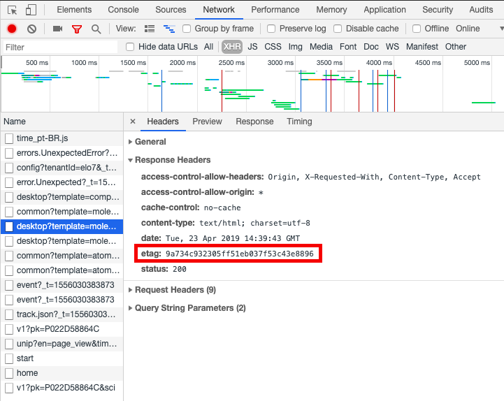

Antes tarde do que nunca! Já acabamos o primeiro trimestre de 2019, mas ainda dá tempo de falar sobre o que fizemos aqui no Elo7 no time de front end. E nesse post vou falar melhor sobre quais foram cada um deles.

## Intersection Observer
Começamos a usar bastante a API do *Intersection Observer*, principalmente nos nossos carrosséis de imagens ao longo do site.


A [Aline Lee](/autor/alinelee) fez [um post só sobre ele](/intersection-observer), mas para resumir, com ele, você consegue observar um determinado elemento, que te avisa sempre que este aparece na área visível da página. Uma das grandes vantagens dele, é não precisar observar sempre o scroll da página, trazendo um ganho de performance. Quanto a compatibilidade, alguns browsers e versões ainda não estão compatíveis. Para resolver esse problema, aqui usamos esse [polyfill](https://github.com/w3c/IntersectionObserver/tree/master/polyfill).


No caso do nosso carrossel, nós utilizamos para observar quando a próxima imagem está visível para colorir a bolinha correspondente à sua posição. Para maiores detalhes de implementação, veja no [post da Aline Lee](/intersection-observer).

## CSS Grid Layout
Uma "novidade" do CSS, o *Grid Layout* veio fazendo sucesso desde quando as primeiras specs surgiram. Mas tivemos que esperar um pouco para usá-lo, por conta da sua compatibilidade com diferentes browsers.


Depois de alguns testes e tentativas, e também na melhora das compatibilidades, conseguimos finalmente colocar o *Grid Layout* no site, e em uma situação não tão convencional. Queríamos separar esses componentes em 3 colunas, e queríamos deixar o layout bem flexível.


O `position: absolute` até resolveria, mas seria bem mais complexo de resolver. Nesse caso, o código ficou assim:

```css
footer {
    display: grid;
    grid-template-columns: repeat(3, 1fr);
}
```

E no elemento de "Enviar", nós só posicionamos ele no lugar correto, com:

```css
.share {
    grid-column-start: 3;
}
```

Se quiser saber mais sobre o *Grid Layout*, tem tudo na [documentação da MDN](https://developer.mozilla.org/pt-BR/docs/Web/CSS/CSS_Grid_Layout/Basic_Concepts_of_Grid_Layout)

Um outro caso que usamos, o mais convencional, foi para separar cada um dos cards de produto. E nesse caso, além da facilidade, também decidimos por usá-lo para alinhar melhor a nossa comunicação com o time de design, que já está bem acostumado a falar na "linguagem dos grids".


## JSON-LD
É bem importante o uso dos dados estruturados para melhorar o SEO da sua página. Mas existem algumas formas de fazer isso, mas aqui vou falar apenas de duas: **microdados** e **JSON-LD**. Usávamos a estrutura de microdados por aqui, mas por recomendação do próprio Google, migramos para o *JSON-LD*.

Os *microdados*, são uma especificação baseada no *HTML*, e os dados estruturados são colocadas no meio do *HTML* visível para o usuário. Já no *JSON-LD*, as informações ficam em uma tag `<script>`, como no exemplo abaixo:

```js
<script type="application/ld+json">
{
    "@context": "http://schema.org",
    "@type": "Offer",
    "price": "30.30",
    "priceCurrency": "BRL",
    "itemOffered": {
      "@type": "Product",
      "name": "Caixa para brigadeiro!",
      "image": {
        "@type": "ImageObject",
        "contentUrl": "https://img.elo7.com.br/product/original/1B4D545/brigadeiro-de-chocolate-belga-chocolate-belga.jpg",
        "thumbnail": "https://img.elo7.com.br/product/360x360/1B4D545/brigadeiro-de-chocolate-belga-chocolate-belga.jpg"
      }
    }
}
</script>
```

Nesse exemplo foi representado uma oferta de um produto, você pode conhecer mais sobre essas estruturas no [guia de dados estruturados da Google](https://developers.google.com/search/docs/guides/intro-structured-data?hl=pt-br) e testar qualquer página ou código [online](https://search.google.com/structured-data/testing-tool?hl=pt-br).

## Linters
Sempre queremos padronizar nossos códigos de forma automatizada, e nada melhor para isso do que usar *linters*.

Hoje usamos dois tipos de *linters*, o [stylelint](https://stylelint.io/) e o [eslint](https://eslint.org/), e sempre rodamos eles junto com os testes antes de cada commit. Mas o uso de *linters* sempre é recomendado?

Bom... descobrimos que em algumas situações eles mais atrapalham do que ajudam. Foi o caso do [htmllint](https://www.npmjs.com/package/htmllint-cli), que removemos depois de um tempo. Isso aconteceu porque usamos o [Dust.js](http://www.dustjs.com/) e isso acabava confundindo o *linter* que estava preparado para funcionar com HTML puro. E o que acontecia, é que tínhamos que ficar sempre adaptando, criando hacks, e "burlando" o *linter* para funcionar corretamente. Até que percebemos que ele não estava verificando o que queríamos de fato e estava atrapalhando o nosso desenvolvimento. Por esse motivo, decidimos removê-lo.

Mas isso significa que todo *linter* não funciona? Claro que não! Para nós, o que funcionou melhor e bem foram os *linters* de CSS e JS, e continuam funcionando bem até hoje. Vale a pena testar e ver se adequa ao seu ambiente de desenvolvimento.

## Etag
Cache é algo sempre complicado de desenvolver e que se não feito da forma correta, pode não atualizar modificações mais recentes ou sempre atualizar tudo. Um dos mecanismos do *HTTP* para lidar com o cache, é o uso do **Etag**. Esse tipo de *header* faz uma validação condicional do cache. Enquanto não houver alteração no conteúdo do arquivo, o valor do *Etag* continua o mesmo e fica cacheado.

Nós começamos a utilizar esse tipo de *header* para melhorar o cache dos nossos arquivos e conseguir otimizar a performance. Nesse método, o próprio navegador faz as verificações dos valores do *Etag* e decide o que fazer. Nós implementamos para que o servidor gerasse esse valor do *Etag* para que assim o navegador conseguisse fazer o restante do trabalho.




## Non-interaction
Para coletar métricas, enviamos eventos de diversos tipos para o *Google Analytics*, pode ser que o usuário tenha visualizado alguma parte do site, ou clicado em algum lugar ou navegado, enfim, existem diversos tipos de eventos. Mas nem sempre o usuário realmente interagiu com algo, ele pode ter apenas visualizado algo e não ter feito nada e você querer enviar uma métrica para saber disso. E existe uma forma de aperfeiçoar ainda mais esses eventos e ter métricas ainda mais precisas, usando o **non-interaction**. Quando temos esses casos de eventos que são enviados para o *Analytics* que não tem nenhum tipo de interação normalmente essa métrica é contabilizada para as métricas de rejeição. Quando adicionamos o atributo `non-interaction`, essas métricas deixam de ser contabilizadas, deixando as métricas mais precisas e reais.

Para conhecer mais, veja a [documentação do Google Analytics :)](https://developers.google.com/analytics/devguides/collection/analyticsjs/events?hl=pt).

## Conclusão
Essas foram as principais tecnologias que marcaram o nosso 2018, todas elas ainda estamos incrementando cada vez mais, e estamos trazendo cada vez mais tecnologias para fazer parte do nosso trabalho! O que você tem usado no seu front de interessante ou estão estudando? Compartilhe conosco ;D
