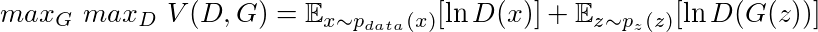
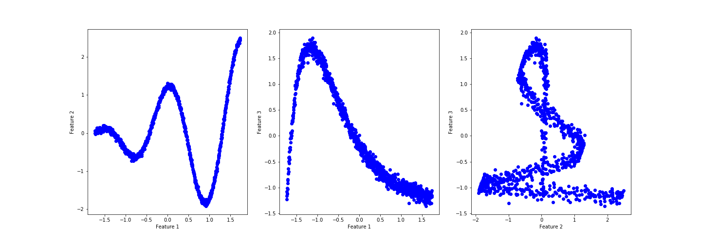
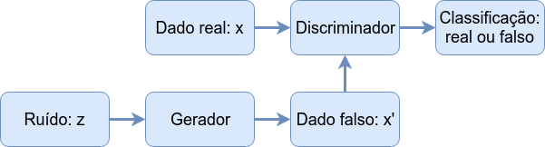
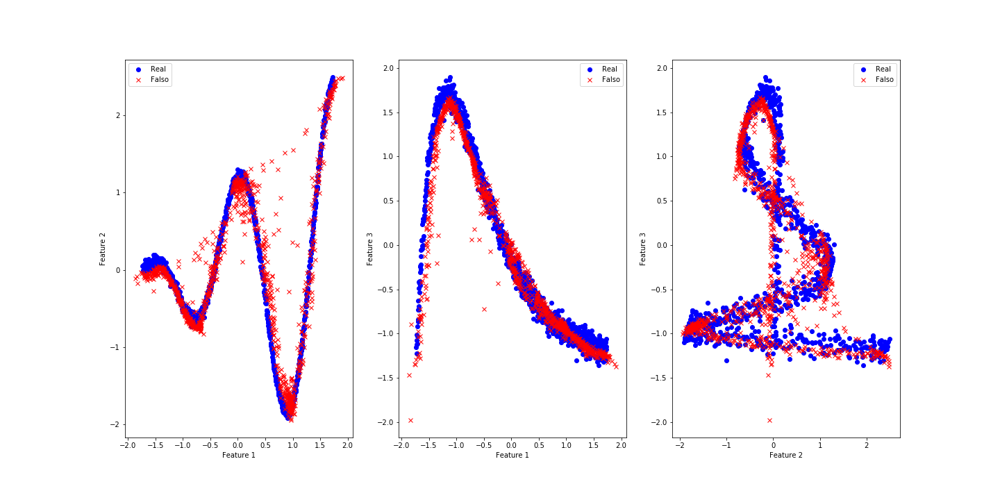
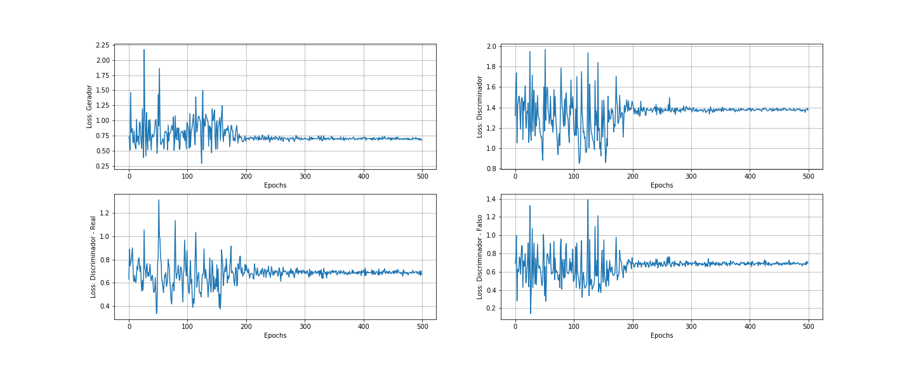

Em 2014 foi publicado um artigo entitulado *[Generative Adversarial Nets](https://papers.nips.cc/paper/5423-generative-adversarial-nets.pdf)* (GAN) propondo uma arquitetura de redes neurais que poderia gerar dados sintéticos que seriam indistinguíveis dos dados reais que foram usados na sua criação. Para quem está por dentro do mundo de Inteligência Artifical dois autores se destacam: o autor principal Ian Goodfellow que foi recentemente contratado pela [Apple](https://www.cnbc.com/2019/04/04/apple-hires-ai-expert-ian-goodfellow-from-google.html) (estava no Google) para liderar a equipe de Inteligência Artificial; e o pesquisador Yoshua Bengio que recentemente recebeu o [Turing Award](https://epocanegocios.globo.com/Tecnologia/noticia/2019/03/padrinhos-da-inteligencia-artificial-sao-premiados-com-nobel-da-computacao.html) junto com Geoffrey Hinton e Yann LeCun (outros dois nomes fortes em IA).

A proposta de gerar dados sintéticos não é nova, há diversas técnicas que envolvem variáveis latentes que circulam em torno desse objetivo. Entretanto, houve uma explosão de aplicações de GAN principalmente nas áreas de visão computacional e reconhecimento de voz, pois estas redes possuem características únicas que permitem identificar propriedades nos dados e as usar em outros dados, veja o exemplo que a [NVIDIA mostrou recentemente](http://openaccess.thecvf.com/content_CVPR_2019/papers/Karras_A_Style-Based_Generator_Architecture_for_Generative_Adversarial_Networks_CVPR_2019_paper.pdf):


As duas pessoas nesta imagem não existem, foram criadas artificialmente usando GAN. Impressionante, não? Segundo [Yann LeCun](https://www.quora.com/What-are-some-recent-and-potentially-upcoming-breakthroughs-in-deep-learning) (Diretor de IA no Facebook) "Isso (GAN), e suas variações que estão sendo propostas agora, é a ideia mais interessante nos últimos 10 anos em Machine Learning, na minha opinião."

## Gerador e o Discriminador

A construção de GAN é bem simples na verdade. Imagine que uma criança (chamada de Gerador) deve levar um documento da escola para que seja assinado pela sua mãe (chamado de Discriminador). Chegando em casa a criança apresenta isso:


A mãe então analisa o documento, percebe que é falso e a criança fica de castigo. Ao longo da vida na escola esta criança tem a oportunidade de ver documentos verdadeiros e passa e entender como produzir um documento falso que pode enganar sua mãe. A qualidade da falsificação só pode ser testada se esta for colocada sob teste e portanto há um risco de penalização, o castigo. Se este processo se repete muitas vezes pode chegar o ponto em que a mãe não saberá mais diferenciar um documento falso do real.

Este processo é chamado de treino adversarial, uma espécie de jogo entre dois agentes, o Gerador (falsificador) e o Discriminador (o investigador). As redes neurais construídas com base nesta estrutura são chamadas de Redes Geradoras Adversariais.

Sendo um pouco mais técnico, treinamos dois modelos simultaneamente: um modelo gerador *G* que aprende como os dados reais estão distribuídos e um modelo discriminador *D* que estima a probabilidade de um dado ser real ou vindo de *G*. Assim, o objetivo é otimizar *G* de modo que a estimativa de acerto de *D* seja $\frac{1}{2}$.

Em termos de redes, para que o gerador aprenda a distribuição dos dados:

$p_{g}(x),$

definimos uma distribuição de ruído:

$p_{z}(z)$

e um mapeamento de $G(z;\theta_{g}):Z \rightarrow X$,

onde *G* deve ser diferenciável com parâmetro $\theta_{g}$ e *z* é dita variável latente. Definimos também o mapa diferenciável

$D(x;\theta_{d}): X \rightarrow [0,1]$,

onde o intervalo $[0,1]$ é o espaço de probabilidade de $x$ ser real.

Desta maneira treinamos $D$ para maximizar a probabilidade de acerto de uma amostra ser real ou falsa (vinda de $G$) e ao mesmo tempo treinamos $G$ para minimizar a probabilidade de ser descoberto, $\ln(1-D(G(z)))$. Na prática Goodfellow observou que minimizar $\ln(1-D(G(z)))$ faz os gradientes convergirem para zero rapidamente e maximizar $\ln(D(G(z)))$ é equivalente e permite gradientes com valores mais altos. Assim a função objetivo é:



Então está estabelecido este jogo entre Gerador e Discriminador, a função $V(D,G)$ atingirá seu valor máximo quando o equilíbrio de Nash for atingido, ou seja, quando nenhum dos dois conseguir melhorar sua performance. Assim a função acima será utilizada como função de perda do problema.

Ok, hora de colocar isso em prática.

## Construindo as redes

Vamos usar para esse exemplo um dataset sintético com algum ruído:

```python
import numpy as np

noise = np.random.normal(size=1000)
x1    = 2*np.pi*np.arange(0,1,0.001) 
x2    = x1*np.cos(2*x1) + noise*0.1
x3    = np.exp(-x1)*x1 + noise*0.01

X_data = np.concatenate((x1.reshape(x1.shape[0],1),\
                       x2.reshape(x1.shape[0],1),\
                       x3.reshape(x1.shape[0],1)),axis=1)
```

Eis os dados em uma imagem:


Parece que há um padrão razoável, porém complexo. Se houvesse muito ruído seria necessário limpar os dados primeiro.

Construiremos as redes usando o [Pytorch](https://pytorch.org/), portanto temos que transformar o *X_data* em um tensor, aproveitando para melhorar a distribuição dos dados com o [StandardScaler](https://scikit-learn.org/stable/modules/generated/sklearn.preprocessing.StandardScaler.html):

```python
import torch
from sklearn.preprocessing import StandardScaler

X_data = StandardScaler().fit_transform(X_data)
X_tc = torch.Tensor(X_data).type(torch.FloatTensor)
print(X_tc.shape, X_tc.type())
>>> torch.Size([1000, 3]) torch.FloatTensor
```
Esse dataset tem 1000 amostras, vamos fazer um batch training com 25 amostras por vez. Uma dica simples para escolher o número de amostras por batch é pegar um número inteiro próximo da $\sqrt{n}$, onde $n$ é o número de amostras. Para fazer o batch training usaremos o DataLoader do Pytorch e vamos optar por fazer o treino em CPU, para usar a GPU veja [aqui](https://pytorch.org/docs/stable/notes/cuda.html).

```python
import torch.utils.data as Data

batch_size = 25
X_dim = X_tc.shape[1]
torch_dataset = Data.TensorDataset(X_tc)
loader = Data.DataLoader(
        dataset = torch_dataset,
        batch_size = batch_size,
        shuffle=True)
```

Agora precisamos definir a arquitetura da rede, usaremos apenas uma camada com 50 neurônios e 20 dimensões para a variável latente. Não há uma regra para escolher esses valores, é necessária alguma experimentação. Entretanto, é sempre bom começar com valores baixos, assim o código roda mais rápido e você descobre logo o resultado. Há apenas um ponto a ser observado aqui, escolher o número de neurônios em relaçao ao número de features dos dados é uma característica de Autoencoders, mas isso fica pra outro post.

O fluxo dos dados é mostrado na figura abaixo e nos dá uma ideia de como construir as redes.



```python
from torch import optim
from torch.autograd import Variable
import torch.nn.functional as F
from torch import nn

Z_dim = 20    # Dimensão da variável latente
h_dim = 50    # Tamanho da hidden layer
lr    = 1e-3  # Taxa de aprendizado

# Arquitetura do Gerador
class GNet(torch.nn.Module):
    def __init__(self):
        super(GNet,self).__init__()
        self.hidden = torch.nn.Linear(Z_dim, h_dim)
        self.out = torch.nn.Linear(h_dim, X_dim)
    
    def forward(self,z):
        h = F.relu(self.hidden(z))
        X = torch.sigmoid(self.out(h))
        return X

# Arquitetura do Discriminador
class DNet(torch.nn.Module):
    def __init__(self):
        super(DNet,self).__init__()
        self.hidden = torch.nn.Linear(X_dim, h_dim)
        self.out = torch.nn.Linear(h_dim, 1)
    
    def forward(self,X):
        h = F.relu(self.hidden(X))
        y = torch.sigmoid(self.out(h))
        return y

# Instanciamos as redes
G = GNet()
D = DNet()

# Definimos os otimizadores
G_optim = optim.Adam(G.parameters(), lr=lr)
D_optim = optim.Adam(D.parameters(), lr=lr)
```

No caso das funções de perda, quando o Discriminador receber um dado real vamos usar a função *log loss* (binary cross entropy)) com o *label 1* e para o dado falso o *label 0*. Assim, teremos uma função de perda para $G$ e uma para $D$ composta pela soma das perdas de dado real e dado falso. 

```python
# Labels de dados real e falso
ones  = Variable(torch.ones(batch_size, 1))
zeros = Variable(torch.zeros(batch_size, 1))

# Binary cross entropy
D_loss_real_func = nn.BCELoss()  
D_loss_fake_func = nn.BCELoss()
G_loss_func = nn.BCELoss()
```
Um ponto muito importante nesse treino é o problema dos gradientes divergirem ou irem para zero, impedindo que a redes aprendam. Para evitar isso devemos reiniciar os pesos das camadas internas das redes. A discussão de qual função de inicialização é mais melhor é vasta, por fim é sempre bom testar algumas. Abaixo deixei comentadas duas funções que testei, mas a *Xavier Normal* foi a que forneceu melhor desempenho.

```python
def init_weights(m):
    if type(m) == nn.Linear:
        torch.nn.init.xavier_normal_(m.weight).cuda()
#         torch.nn.init.kaiming_uniform_(m.weight, a=0.1, mode='fan_in', nonlinearity='relu').cuda()
#         torch.nn.init.kaiming_normal_(m.weight, a=0.5, mode='fan_in', nonlinearity='leaky_relu')
        m.bias.data.fill_(0.001)

#Inicializar pesos das redes
G.apply(init_weights)
D.apply(init_weights)
```

Por fim definimos uma função para monitorar o desempenho do treinamento.

```python
# Avalia o desempenho do discriminador nos dados reais e falsos
def discriminator_test(n_sample,G,D):
    z = Variable(torch.randn(n_sample, Z_dim))
    G_sample = G(z)
    prob_real = D(X_tc)
    prob_fake = D(G_sample)
    print('Average real {:.6f}| Std real {:.6f}'.format(prob_real.mean(),prob_real.std()))
    print('Average fake {:.6f}| Std fake {:.6f}'.format(prob_fake.mean(),prob_fake.std()))
```

Definimos também algumas listas para guardar os valores das funções de perda:

```python
G_his, D_his, D_real_his, D_fake_his = [[],[],[],[]]
losses_his = [G_his,D_his,D_real_his,D_fake_his] 
```

## Treino

Estamos prontos para o treinamento em si. O Dataloader fornecerá os dados de $X_tc$ em batches até completar as $1000$ amostras e esse ciclo se repetirá por $500$ épocas (*epochs*). 

```python
epochs = 500

for epoch in range(epochs):
    for step, batch_x in enumerate(loader):
        # Amostragem de dados
        z = Variable(torch.randn(batch_size, Z_dim))
        X = Variable(batch_x[0])
    
        # Dicriminador
        G_sample = G(z)
        D_real = D(X)
        D_fake = D(G_sample)

        # Passamos dados reais e calculamos o erro, loss
        D_loss_real = D_loss_real_func(D_real, ones)
        # O mesmo para dados falsos
        D_loss_fake = D_loss_fake_func(D_fake, zeros)
        # O erro do Discriminador é a soma dos dois anteriores
        D_loss = D_loss_real + D_loss_fake
        
        D_optim.zero_grad()  # Reinicia os gradientes do otimizador
        D_loss.backward()    # Calcula os gradientes da perda
        D_optim.step()       # Faz o otimizador "passar" os gradientes pela rede

        # Generador
        z = Variable(torch.randn(batch_size, Z_dim))
        G_sample = G(z)
        D_fake = D(G_sample)

        G_loss = G_loss_func(D_fake, ones)
        G_optim.zero_grad()
        G_loss.backward()
        G_optim.step()

    # Mostra resultado parcial das perdas 4 vezes
    if epoch % int(epochs/4) == 0:
        print('Epoch-{}| Average D_loss: {:.5f}| Average G_loss: {:.5f}'.format(
            epoch, D_loss.data, G_loss.data))
        # Mostra probabilidades do Discriminador
        discriminator_test(500,G,D)


>>> Epoch-0| Average D_loss: 1.73391| Average G_loss: 0.44165
    Average real 0.571132| Std real 0.047926
    Average fake 0.654227| Std fake 0.052667
>>> Epoch-125| Average D_loss: 1.36265| Average G_loss: 0.83363
    Average real 0.478787| Std real 0.124491
    Average fake 0.432555| Std fake 0.079227
>>> Epoch-250| Average D_loss: 1.36687| Average G_loss: 0.68600
    Average real 0.509063| Std real 0.086357
    Average fake 0.495081| Std fake 0.059590
>>> Epoch-375| Average D_loss: 1.43308| Average G_loss: 0.68586
    Average real 0.509467| Std real 0.079206
    Average fake 0.516861| Std fake 0.063268
    CPU times: user 8min 44s, sys: 2.89 s, total: 8min 47s
    Wall time: 44.6 s
```

Em um caso ideal gostaríamos que ambas *Average real* e *Average fake* fossem 0.50, indicando que o Discriminador erra em 50% das vezes e logo nos primeiros estágios do treino as redes já estão próximas para esse valor. Como uma avalição para todo o modelo usamos a função *discriminator_test* para testar com todo o dataset real e mais 1000 dados falsos gerados por $G$.

```python
discriminator_test(1000,G,D)
>>> Average real 0.506466| Std real 0.014672
>>> Average fake 0.503768| Std fake 0.019862
```

Sem muito esforço o Discriminador já não consegue diferenciar entre os datasets. Agora se quisermos usar $G$ para gerar novos dados basta chamar $G$ fornecendo  ruído:

```python
n = 3  # Número de amostra que queremos gerar
z = Variable(torch.randn(n, Z_dim))
X_fake = G(z)
X_fake
>>> ttensor([[ 0.0738,  1.1339, -0.2117],
        [-1.5639, -0.0619, -0.5154],
        [-1.5256, -0.0177,  0.4263]], grad_fn=<AddmmBackward>)
```

## Avaliação do desempenho

As duas maneiras iniciais que usaremos para saber se fizemos um bom trabalho são visualizar os dados reais e falsos juntos e visualizar as perdas ao longo do treino:





Os resultados parecem muitos bons para uma rede tão simples. As oscilações das perdas que podemos observar são causadas pelo processo de treino. O Discriminador treina primeiro e portanto está sempre um passo à frente do Gerador, mas é alcançado em seguida. A oscilação diminuiu muito perdo da época 200 indicando que o equilíbrio de Nash está próximo nesse jogo, não há muito mais o que melhorar após isso.

Como teste final vamos unir o dataset real com mais 1000 amostras falsas e verificar como o Discriminador se sai como um classificador de dados.

```python
z = Variable(torch.randn(1000, Z_dim))
X_fake = G(z)

from sklearn.metrics import confusion_matrix, classification_report
import pandas as pd

# DataFrame real
df_real = pd.DataFrame(data=X_data,columns=['x1','x2','x3'])
df_real['reality_label'] = 1
# Dataframe falso
df_fake = pd.DataFrame(data=X_fake.data.numpy(),columns=['x1','x2','x3'])
df_fake['reality_label'] = 0

# Concatemos e embaralhamos os dois
df_mixed = pd.concat([df_real,df_fake],axis=0)
df_mixed = df_mixed.sample(frac=1.0)

# Separamos o label para ser o target
X_mixed = df_mixed.drop('reality_label',axis=1).copy()
y_mixed = df_mixed['reality_label'].copy()

# Transformamos em tensores
X_mix_tc = torch.Tensor(X_mixed.values).type(torch.FloatTensor)
y_mix_tc = torch.Tensor(y_mixed.values).type(torch.FloatTensor)
```

Então retornamos as previsões feitas pelo Discriminador.
```python
y_predict = D(X_mix_tc)

# Confusion Matriz de confusão
print(confusion_matrix(
                    y_mix_tc.data.numpy().reshape(2000,),
                    np.round(y_predict.data.numpy().reshape(2000,),0)))
>>> [[404 596]
     [397 603]]

# Relatório de classificação
print(classification_report(
 y_mix_tc.data.numpy().reshape(2000,),\
 np.round(y_predict.data.numpy().reshape(2000,),0),digits=5))
>>>   Classification Report:
              precision    recall  f1-score   support

         0.0    0.50437   0.40400   0.44864      1000
         1.0    0.50292   0.60300   0.54843      1000

    accuracy                        0.50350      2000
   macro avg    0.50364   0.50350   0.49854      2000
weighted avg    0.50364   0.50350   0.49854      2000
```

Da matriz de confusão temos que:

Verdadeiros negativos (TN) = 404 - 20%  
Falsos positivos (FP)      = 596 - 30%  
Falsos negativos (FN)      = 397 - 20%  
Verdadeiros positivos (TP) = 603 - 30%  
  
O Discriminador "está confuso", na maioria das vezes ele classifica os dados como reais. Os dados reais são classificados como falsos com a mesma porcentagem que os dados realmente falsos.

O relatório de classificação mostra as métricas que são consequência dos dados vistos na matriz de confusão, como a acurácia em 50%. Poderíamos pensar que este índice de acerto pode indicar um overfitting, mas não é um caso já que o Discriminador nunca vê o target real.

Bom, dessa maneira construímos uma Rede Geradora Adversarial, se quiser o código todo está [aqui](https://github.com/onimaru/Generative_models/blob/master/GAN/GAN_example.ipynb).
Um dia eu volto com mais aplicações disso, valeu.
