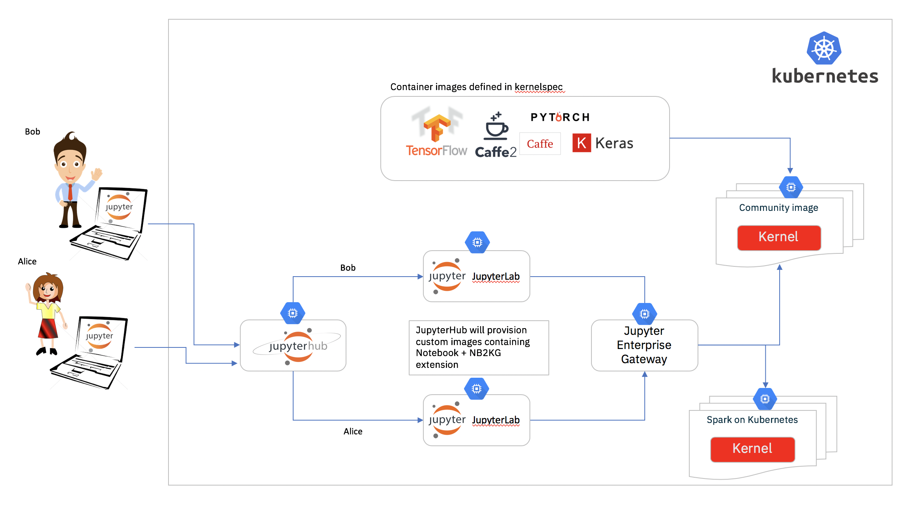

[Jupyter](https://jupyter.org/) é uma ferramenta para desenvolvimento iterativo com suporte a diversas linguagens. No Elo7 é amplamente utilizado pelo time de Ciência de Dados e mais atualmente pelo time de Engenharia de Dados. O _jupyter_ faz uso do que ele chama de _kernels_ para execução de _notebooks_, já os _notebooks_ são onde se encontram os códigos que serão executados. O _jupyter_ possui diversos _kernels_, que definem a linguagem suportada e até mesmo algumas características de como executá-la.

 A seguir iremos detalhar como utilizamos o [Kubernetes](https://kubernetes.io/) para uma arquitetura elástica do [Jupyter](https://jupyter.org/).

## Old school

O time de ciência de dados já utilizava o [Jupyter](https://jupyter.org/) há um bom tempo, porém, eles possuíam uma máquina bem grande na [aws](https://aws.amazon.com/) que era compartilhada entre todos os desenvolvedores.

Neste cenário, cada desenvolvedor que deseja utilizar-se do _jupyter_, acessa a máquina via _ssh_ e cria seu _container_ _docker_ do _jupyter_. A imagem do container era gerada por eles onde diversos pacotes eram instalados. Podemos citar algumas características deste cenario:

- Os desenvolvedores eram livres para utilizarem a imagem _docker_ que desejassem, porém partiam de uma mesma imagem base
- O disco da máquina _host_ era compartilhado entre todos os _containers_, sendo assim, compartilhado por todos os desenvolvedores, o que facilitava o compartilhamento de código e dados gerados entre eles, porém o espaço em disco utilizado era consumido da máquina host.
- Toda a configuração para iniciar o _jupyter_ era realizada manualmente, o que gerava certo trabalho por parte dos desenvolvedores.
- Não havia controle de uso de recursos, um desenvolvedor poderia consumir todos os recursos da máquina.
- Pelo fato de ser um servidor compartilhado, podemos mencionar:
  - Em diversos momentos ficava ocioso (com apenas um usuário utilizando) ou mesmo sem uso
  - Falta de recursos quando a maioria dos desenvolvedores competiam por recusrsos no servidor, o que poderia impactar diretamente o trabalho de todos os desenvolvedores
- Em algumas ocasiões, hardware diferente era necessário, como uso GPUs, o que requisitava a criação de outra máquina para essas ocasiões.

Como foi observado, este cenário trazia grande liberdade aos desenvolvedores, ao mesmo tempo em que poderia atrapalhar seu desenvolvimento no dia a dia.

## Jupyter no Kubernetes

Tínhamos a ideia de criar um ambiente em que, ao efetuar login, cada usuário receberia acesso a um _jupyter_ seu, onde os recursos ficariam isolados, de forma que não houvesse impacto a outros usuários, o que é possível através do [Jupyter Hub](https://github.com/jupyterhub/jupyterhub), que gerencia múltiplas instâncias de jupyter, com suporte ao _kubernetes_.

Com essa ferramenta já éramos capazes de criar diversos _jupyters_, um para cada usuário, e vale ressaltar que o [Jupyter Hub](https://jupyterhub.readthedocs.io/en/stable/reference/authenticators.html) suporta diversos mecanismos de autenticação, o que simplifica bastante sua implantação.

Com ele também foi possível configurar um _storage_ para cada usuário, com espaço dedicado para seu uso, veja https://z2jh.jupyter.org/en/latest/customizing/user-storage.html para maiores detalhes. Note que o _jupyter hub_ utiliza [Persistent Volumes](https://kubernetes.io/docs/concepts/storage/persistent-volumes/) para provisionar esses discos.

Legal, agora cada desenvolvedor tem seu próprio _jupyter_ com seu próprio _storage_, porém os recursos são determinados no momento do _login_ no _jupyter_, e estes não podem ser alterados em _ runtime_, portanto caso um desenvolvedor tenha a necessidade de um alto consumo de recursos em alguma tarefa que esteja desenvolvendo, ou mesmo necessite de hardware especial, como GPUs, não será possível com esta solução, voltando ao mesmo cenário descrito anteriormente.

## Jupyter Enterprise Gateway

O [Jupyter Enterprise Gateway](https://jupyter-enterprise-gateway.readthedocs.io/en/latest/) introduz mais uma camada, onde além do _jupyter_ ser provisionado no _kubernetes_, agora os _kernels_ também são provisionados como _pods_ independentes.



Sendo assim, ao efetuar o _login_, é criado um _pod_ para cada usuário. Quando o usuário abre um _notebook_ o _enterprise gateway_ cria um pod para a execução do kernel. Desta forma é possível ter diversos tipos diferentes de _kernels_, cada um com perfil de consumo de recursos diferentes e inclusive requisitos de hardware distintos. Por exemplo, você pode possuir os seguintes _kernels_:

- Spark Scala com GPU, onde ao iniciar este _kernel_ é provisionada uma máquina com GPU e o _kernel_ é iniciado nela
- Python3 H1, que pode significar uma _kernel_ que necessite de 32Gb de memória e 4 CPUs

Com um cluster _kubernetes_ bem configurado, assim como as regras para _autoscale_ das máquinas na aws, você terá acesso a um cluster elástico de acordo com a necessidade dos desenvolvedores a cada momento do dia.

Um excelente tutorial de como instalar toda essa infra-estrutura é encontrado em: [Introducing Jupyter Enterprise Gateway](https://blog.jupyter.org/introducing-jupyter-enterprise-gateway-db4859f86762).

## Jupyter Enterprise Gateway no Elo7

No Elo7, o _jupyter_ é executado em um _cluster_ elástico, onde as máquinas são provisionadas de acordo com o uso. Vale ressaltar que este cluster utiliza somente uma única [AZ](https://docs.aws.amazon.com/pt_br/AWSEC2/latest/UserGuide/using-regions-availability-zones.html#concepts-regions-availability-zones), devido à limitação dos [EBS](https://aws.amazon.com/pt/ebs/), o qual é utilizado pelo [Persistent Volumes](https://kubernetes.io/docs/concepts/storage/persistent-volumes/). Desta forma, caso o _pod_ do desenvolvedor seja realocado em outra máquina, o seu [Persistent Volumes](https://kubernetes.io/docs/concepts/storage/persistent-volumes/) poderá ser montado na nova instância onde o _pod_ for alocado.

Todas as imagens _docker_ que utilizamos são customizadas para atenderem as nossas necessidades.

Possuímos diversos perfis de _kernels_ configurados, casos para alto e baixo consumo de recursos, além de suporte a GPUs.

Cada usuário possui um limite de até dois _kernels_ simultâneos, porém, devido ao fato de utilizarmos autenticação por usuário com o [Jupyter Hub](https://github.com/jupyterhub/jupyterhub), foi necessária a alteração abaixo para que o [Jupyter Enterprise Gateway](https://jupyter-enterprise-gateway.readthedocs.io/en/latest/) interpretasse corretamente os usuários, no caso utilizamos o [helm](https://helm.sh/) para instalação do _jupyter hub_:

```python
hub:
  db:
    type: sqlite-memory
  extraConfig: |-
    from kubespawner import KubeSpawner
    from tornado import gen
    import yaml
    class CustomKubeSpawner(KubeSpawner):
        def get_env(self):
            env = super().get_env()
            env['KG_HTTP_USER'] =  self.user.name
            env['KERNEL_USERNAME'] =  self.user.name
            return env
    c.JupyterHub.spawner_class = CustomKubeSpawner
    config = '/etc/jupyter/jupyter_notebook_config.py'
    c.Spawner.cmd = ['jupyter-labhub']
    c.KubeSpawner.namespace_name_template = 'hub-{username}'
    ...
```

Quando o usuário efetua login pela primeira vez, ele deve configurar seu acesso ao github, utilizando suas credenciais, devido o fato de que cada usuário recebe um [Persistent Volumes](https://kubernetes.io/docs/concepts/storage/persistent-volumes/), o qual é mantido indeterminadamente.

Outro ganho que tivemos com esta arquitetura foi no agendamento dos _notebooks_: o mesmo _notebook_ utilizado durante o desenvolvimento no _jupyter_ pode ser agendado através do [Apache Airflow](https://airflow.apache.org/) e [papermill](https://papermill.readthedocs.io/en/latest/), que apresentaremos em um post futuro.

## Problemas encontrados

Com essas ferramentas conseguimos resolver boa parte dos nossos problemas no uso do _jupyter_, como uso de disco e recursos, porém nem tudo são flores, e atualmente temos as seguintes limitações:

- Não é possível compartilhar _notebooks_ através de _imports_ ou dados, porque somente o _notebook_ em execução é montado no _pod_ onde o _kernel_ o executa. Para solucionar esse problema, pretendemos analizar uma solução com o [EFS](https://aws.amazon.com/pt/efs/) através de discos compartilhados. Para compartilhar dados, atualmente, utilizamos o S3.
- O uso de containers customizados _on-demand_ não é possível, portanto, os desenvolvedores muitas vezes instalam pacotes através do notebook, o que resolve em muitos casos, mas caso utilizem o [Apache Spark](https://spark.apache.org/), a mesma solução não funciona, porque a instalação dos pacotes somente ocorrerá no _driver_ do _spark_. Logo, esta alternativa somente funciona em _kernels_ python, _kernels_ como o do Spark em Scala não é possível esta solução.

Para _notebooks_ em Scala, existe um bug no [Apache Toree](https://toree.apache.org/), que é utilizado por _kernels_ com suporte a Scala, onde células que falhem em sua execução não retornam erro, desta forma ferramentas como [papermill](https://papermill.readthedocs.io/en/latest/) não conseguem identificar quando houve uma falha na execução de um _notebook_. Já existem iniciativas para a correção deste problema, veja [TOREE-508](https://issues.apache.org/jira/browse/TOREE-508) para maiores detalhes.

## Conclusão

Através do uso do [Jupyter Enterprise Gateway](https://jupyter-enterprise-gateway.readthedocs.io/en/latest/) em conjunto com [Jupyter Hub](https://github.com/jupyterhub/jupyterhub) conseguimos melhorar o uso do _jupyter_ no Elo7, onde os cientistas de dados resolveram alguns dos problemas que tinham. Além disso foi possível realizar uma redução de custos, porque somente existem instâncias em execução enquanto há uso de algum desenvolvedor. Outro fator responsável pela redução de custos foi o uso de [spot instances](https://aws.amazon.com/pt/ec2/spot/).

Após a implantação dessas ferramentas, a adoção por outras equipes da empresa foi simplificada, o que ajudou bastante.
