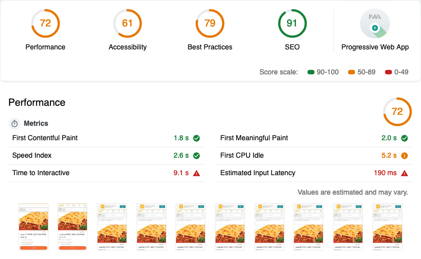

http://metrics.elo7aws.com.br:3000/d/000000138/dorne?orgId=1&from=1562293299265&to=1564976499944&var-platform=mobile&var-page=produto&var-gtm=remove_gtm&var-test=default&var-test=shared_worker_inactive

- CSS inline
- JS inline (parece que impactou negativamente o first-contentful-paint; benefício difícil de ver pois foi deployado junto com remoção de AJAXes do i18n)
- Remover JS não usado (polyfills/fallbacks) (não deu para capturar impacto pelo Dorne pois métricas começaram a ser coletadas depois)
- Requests síncronos no carregamento (maior impacto)
  - 1o deploy: 08/07 - inline async-define + remove AJAXes do i18n (aumentou first-contentful-paint de 1,8 para 1,9 s)
  - 2o deploy: 09/07 - remove AJAXes dos templates (morte dos has-js + CSS específico para noscript)
  - 3o deploy: 11/07 - remove onboarding-tooltip no carregamento da página (nym.load)
- Preconnect 01/08: melhorou first-contentful-paint de 1,9 s para 1,8 s; aumentou um pouco page size - 489 p/ 509 kb - mas diminuiu número de conexões - 80 p/ 72

Em março desse ano, colocamos no ar uma nova versão da nossa página de produto mobile no ar. Foi um redesign tanto visual quanto na parte de código front-end!

Também foi uma mudança tecnológica significativa. A versão anterior era totalmente servida pelo nosso back-end escrito em Java. A nova versão é servida parte pelo mesmo back-end, parte por um serviço de templates de front-end [isomórficos](/isomorfismo/) (a [Fernanda Bernardo](/autor/fernandabernardo/) deu [uma palestra sobre isso](https://www.youtube.com/watch?v=tY17t5HHELo), inclusive). Com esse sistema, conseguimos um front-end mais componentizado e mais fácil de programar, já que ele usa a mesma lógica para renderizar e para atualizar cada componente.

Todavia, essa mudança trouxe um ponto negativo não previsto: a performance de carregamento da página piorou bastante, prejudicando a experiência dos nossos usuários e a classificação nas ferramentas de busca. No ambiente de desenvolvimento, acessando a página sendo servida na própria máquina, sem problemas de conexão, essa piora não era perceptível, mas num celular real, mesmo acessando a página via conexão *wi-fi*, era visível que havia uma certa demora no carregamento. Essa demora ficava ainda mais visível olhando os números do [Google PageSpeed](https://developers.google.com/speed/pagespeed/insights/?hl=pt-br) e do [Lighthouse](https://developers.google.com/web/tools/lighthouse?hl=pt-br).

Esses relatórios foram o principal indicativo de que algo estava errado, e também foram guias essenciais na melhoria da página.

## Antes, uma precaução

Analisando os relatórios, em certos momentos notávamos melhoras ou pioras que não conseguíamos explicar do nosso lado: nenhum deploy realizado, nenhuma alteração na infra-estrutura, nenhum teste A/B promovido... Restavam os parceiros de marketing, os pixels que carregamos em algumas páginas do Elo7. E, de fato, algumas alterações nesses pixels podem impactar consideravelmente o tempo de carregamento da página. Uma vez que percebemos esse fator, passamos a extrair métricas de performance com os pixels ligados e desligados. Dessa forma, conseguimos identificar se um problema de desempenho está sendo causado por uma funcionalidade nossa ou não e tomar as medidas mais adequadas.

## Examinando o relatório

## Alterações e impacto

## Conclusão

Foto de capa: "<a href='https://www.flickr.com/photos/25463427@N05/2773733589' rel='nofollow noopener' target='_blank'>Bavaria City Racing 2008</a>" por Niels Broekzitter (licença <a href='https://creativecommons.org/licenses/by/2.0/deed.pt_BR' rel='nofollow noopener' target='_blank'>CC BY 2.0</a>).

