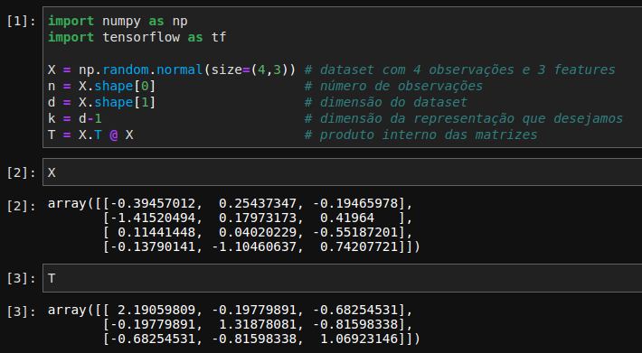
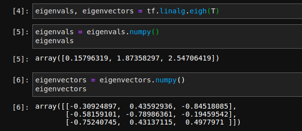
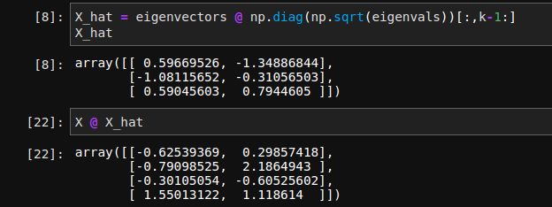

Seguindo com o assunto de Manifold Learning vamos ver como funciona a técnica chamada **Isometric map**, mas um dos passos dela é uma técnica chamada **[Multidimensional Scaling (MDS)](https://en.wikipedia.org/wiki/Multidimensional_scaling)**, por isso primeiro vamos ver como MDS funciona.

## Matriz de distância

Dado um dataset $X$ com $n$ observações e $D$ dimensões, precisamos de uma matriz de distância $\mathcal{d} \in \mathbb{R}^{n \times n}$, ou seja, uma matriz em que cada elemento $d\_{ij}$ representa um tipo de distância da observação $x\_{i}$ até a observação $x\_{j}$, desse modo, $d\_{ii}$ (os elementos da diagonal principal) são sempre iguais a zero. A distância escolhida em princípio pode ser qualquer uma, mas é usual utilizar a distância euclidiana:

$\mathcal{D}\_{ij} = \vert \vert x\_{i} - x\_{j} \vert \vert^{2}$

Assim, devemos encontrar uma representação $\hat{X}$ de dimensão $d$ dos dados tal que a matriz de distância $\hat{\mathcal{D}}$ seja solução de

$min\ \sum\_{i}\sum\_{j} \left( \mathcal{D}\_{ij} - \hat{\mathcal{D}}\_{ij}  \right)^{2}$

**Novamente**: nosso objetivo é encontrar uma representação dos dados de dimensão diferente de $D$, geralmente menor, e que mantenha as distâncias relativas entre os pares de pontos o mais próximas possíveis das originais.

Se a distância for euclidiana podemos usar o produto interno de $X$ com sua transposta, $X^{T}$ para produzir:

$ X^{T}X = -\frac{1}{2}J \cdot \mathcal{D} \cdot J$

onde $J\_{n} = \mathbb{I}\_{n}- \frac{1}{n}\mathbb{O}\_{n}$ é a [matriz centralizadora](https://en.wikipedia.org/wiki/Centering_matrix) e $\mathbb{O}\_{n}$ é a matriz $n \times n$ com todos os elementos 1. Essa transformação de $\mathcal{D}$ no produto interno de uma matriz com sua transposta é as vezes chamada de *Gram matrix* e é válida para qualquer matriz simétrica não negativa com zeros na diagonal.

Isso serve apenas para dizer que podemos fazer uma decomposição de $X^{T}X$ em autovetores e usá-los em uma nova representação. No caso de redução de dimensionalidade, como em outras técnicas, escolhemos os $k$ autovetores com maior módulo.

## Decomposição espectral

Fazemos agora um procedimento típico, encontrar:

$ X^{T}X = U \Lambda U^{T}$

em que $\Lambda$ é a matriz diagonal de autovalores e $U$ é a matriz $n \times n$ cuja $i$-ésima coluna é o $u\_{i}$ autovetor de $X^{T}X$. O objetivo se torna minimizar

$\mathcal{L} = \vert \vert U \Lambda U^{T} - \hat{X}^{T}X \vert \vert = \vert \vert X^{T}X - \hat{X}^{T}X \vert \vert$

que é resolvida por $\hat{X} = U \Lambda^{\frac{1}{2}}$. Se quisermos uma representação $k$-dimensional escolhemos os $k$ maiores valores de $\Lambda$, os autovalores, e construímos a nova representação (o embedding) calculando os autovetores correspondentes. Os vetores de $\hat{X}$ podem ser usados para projetar os vetores originais do dataset na nova representação.

### Exemplo

Vejamos um exemplo simples, vamos gerar um dataset com valores quaisquer com $3$ dimensões e vamos usar os princípios vistos acima para reduzir para $k=2$ dimensões. Para facilitar o cálculo dos autovalores e autovetores faremos com o Tensorflow:

Chamamos o método *linalg.eigh* que recebe a matriz $T$ e retorna um array com os autovalores em ordem crescente e a matriz de autovetores, $U$.

Note que para $k=2$ vamos usar apenas os $2$ maiores valores de *eigenvals*. Podemos calcular a matriz erro $T - U \Lambda U^{T}$, cujos valores devem ser próximos de zero.

Agora calculamos os autovetores de $k=2$ e projetamos $X$ nessas direções:

Feito isso estamos prontos para compreender a técnica chamada Isometric map. Se você conhece a técnica Principal Component Analysis (PCA) deve ter percebido alguma similaridades. Há várias técnicas que utulizam essas matrizes de distâncias ou algum outro tipo de métrica, como a covariância. O ponto importante é que PCA é uma técnica linear e portanto está limitada aos casos em que as observações pertencem a uma variedade sem curvatura, já as técnicas de Manifold Learning podem ser vistas como uma generalização não-linear de PCA.