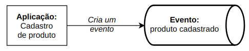

Gostaria de descrever como estamos lidando com a refatoração do nosso monolito para transformá-lo em microsserviços aqui no Elo7. Acredito que cada problema apresenta uma solução mais apropriada que vai além da parte técnica - envolve questões culturais, a clareza do problema raiz pra não trocar a tecnologia (ou técnica) e continuar com o mesmo problema inicial, etc. Pretendo mostrar alguns pontos com o objetivo de dar insights e mostrar nossas experiências.

Mostrarei alguns conceitos que ajudaram a guiar nossas escolhas. E, num post futuro, uma parte prática (código) de como usamos algumas ferramentas. E pra isso vou disponibilizar um repositório com um exemplo completo de como é possível implementar tudo isso.

## Contextualização

Imagine o cenário em que existe um monolito responsável por quase todas as features da empresa. Ele tem um banco de dados, possui uma base de código consideravelmente grande e antiga, escalabilidade sem muita flexibilidade (você não pode escalar apenas uma feature), etc. Ou seja, todos os problemas clássicos que um monolito pode apresentar. 

Quebrar esse sistema traz várias considerações. O primeiro ponto real talvez seja: o pessoal de produto vai apoiar uma refatoração desse nível? 

Aqui podemos pensar em mostrar quais vantagens uma estrutura de microsserviços proporciona: produtividade ao evoluir features de maneira independente. 

Os engenheiros certamente serão os mais afetados: novos desafios, novos problemas, e ao mesmo tempo soluções mais modernas para lidar evolução da plataforma.

Existem [diversas estratégias](https://martinfowler.com/articles/break-monolith-into-microservices.html) para fazer esse tipo de migração. Seja qual for o modo, sempre é levado em consideração que o sistema atual continua em uso, evoluindo (mesmo que minimamente) e tendo correções de bugs. Às vezes separar algumas pequenas partes aos poucos costuma ser o caminho natural e que vai de encontro à cultura ágil. Veja mais sobre o pattern [strangler](https://martinfowler.com/bliki/StranglerFigApplication.html).

## Caso de uso

Algumas features de nossa aplicação podem ter diferentes necessidades para o momento de escrita e o de leitura. 

Vejamos por exemplo um e-commerce. Ele possui um cadastro para vendedores disponibilizarem seus produtos com certas regras de negócio, validações, autenticação, telas específicas (UX) e uma quantidade de acessos baixíssima (somente vendedores logados) chegando à algumas dezenas por minuto. Já as leituras têm um perfil bem diferente, muito conteúdo público, bastante análise para exibir o produto mais adequado na busca, produtos similares ou complementares, recomendações, muitos acessos simultâneos - chegando a milhares de acesso por minuto. Com isso já dá pra perceber a disparidade das demandas. 

Seria legal permitir tecnologias distintas e também o dimensionamento da infraestrutura para cada lado (escrita e leitura). Talvez o sistema de escrita não seja tão crítico quanto o de leitura. Os vendedores ficarem impedidos de cadastrar novos (ou alterar) produtos não parece ser tão prejudicial quanto os compradores não conseguirem visualizar os produtos já cadastrados. A escalabilidade pensada para a leitura parece ser bem desproporcional também, assim como, os [experimentos com testes A/B](https://medium.com/netflix-techblog/its-all-a-bout-testing-the-netflix-experimentation-platform-4e1ca458c15) que não devem ter muita relação com a escrita.

## Command Query Responsibility Segregation (CQRS)

Segundo Martin Fowler, [Command Query Responsibility Segregation (CQRS)](https://martinfowler.com/bliki/CQRS.html) é um padrão em que a modelagem para a escrita pode ser diferente da modelagem para a leitura da informação. Deve-se observar que isso implica em maior complexidade (pois há dois sistemas).

Na prática, há uma aplicação de cadastros que tem toda sua lógica para a escrita podendo ser em banco de dados ou simplesmente criando um evento em um tópico para ser processado assincronamente. Quando processado, o dado pode ficar disponível para a consumo. 

Ou seja, um consumidor pode colocar o dado em algum banco que servirá exclusivamente para leitura, possibilitando assim pensar na melhor ferramenta que resolve esse problema. 

Como essa leitura pode ocorrer de várias formas (busca, recomendação, visualização, etc), cada uma dessas aplicações que precisar exibir o dado pode consumir desse tópico e tratar da forma mais adequada. O consumidor pode, por exemplo, ser um sistema que indexa o dado para busca (no Solr ou Elasticsearch); ou então, o time de machine learning pode criar um algoritmo que consome o dado do produto para gerar recomendações; ou ainda, o sistema que exibe a tela do produto pode consumir o dado e enriquecê-lo chamando o sistema de cálculo do preço à vista ou parcelamento do produto; e assim por diante. 

Todos os sistemas que precisarem do dado poderão fazer apenas consumindo o tópico. Além disso, com a técnica de usar tópicos podemos considerar que os dados estão disponíveis em tempo real e podem [reagir as mudanças](/programacao-reativa/)

___

Temos até aqui uma ideia de como começar a separar pelo menos um tipo de feature. Para o caso apresentado, estamos falando do [contexto do produto](https://martinfowler.com/bliki/BoundedContext.html), mas por hora podemos pensar em dois níveis ainda mais micro: escrita e leitura. Sendo assim, podemos dedicar esforço inicialmente na leitura do produto. 

Ao extrair para um sistema que consiga disponibilizar o dado para leitura, possibilitamos quem está interessado em apenas ler o dado (e fazer algum tratamento especial) começar a ler dessa nova fonte.

Um ponto que pode não ter ficado claro é que **esta não é uma estratégia para quebrar todas as features do monolito** e isso é bom do ponto de vista da flexibilidade. Não queremos ter uma _solução monolítica_, queremos algo flexível, queremos ir para o micro. Talvez tenham mais casos parecidos que impliquem numa solução parecida, mas não obriga que todas as features sejam extraídas da mesma forma. Além do que, ao extrair a primeira feature muitas lições serão aprendidas para ter maturidade de evoluir todo esse processo. Aqui já estamos falando de uma questão de mudança de mindset e de cultura.

Em breve vou falar sobre mais alguns conceitos para que a parte prática tenha embasamento. 

Até mais :)
