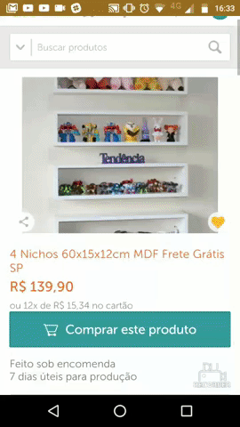
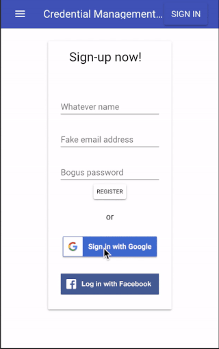
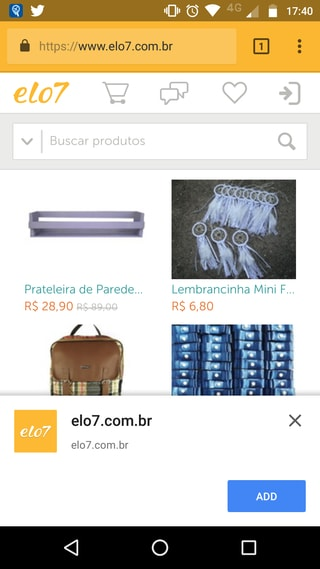
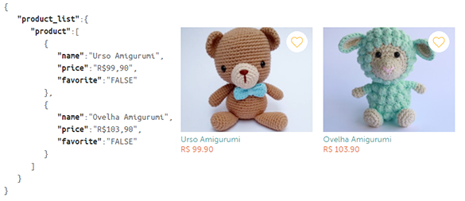
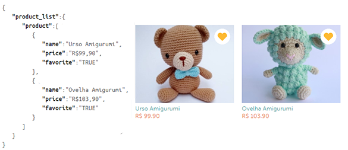
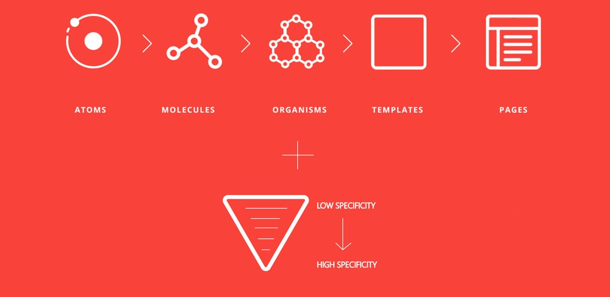

2017 foi um ano recheado de projetos interessantes e desafiantes para nós. Neste post vou fazer um resumão deles.

## Web APIs

A tendência de tornar a web cada vez mais amigável aos usuários, muitas vezes de forma bem parecida ao que acontece com os aplicativos, se mostrou bem forte. E nós temos diversas ferramentas nos navegadores para implementar isso: as <a href='https://developer.mozilla.org/en-US/docs/Web/API' rel='nofollow' target='_blank'>Web APIs</a>.

Foi muito divertido testar e implementar algumas delas:

- [Web Share API](/web-share-api/): Baseada no `navigator.share()`, que possui suporte a partir do Chrome 61 para Android. Com ela, conseguimos utilizar recursos nativos para fazer o compartilhamento de conteúdo nas redes sociais.

- <a href='https://developers.google.com/web/fundamentals/security/credential-management/?hl=pt-br' rel='nofollow' target='_blank'>Credential Management API</a>: Utilizando essa API, que está disponível a partir do Chrome 51, o site é capaz de armazenar e utilizar as credenciais do usuário no login. Assim não é necessário digitar a senha em todos os acessos.
Já implementamos no Elo7 e muito em breve teremos um post falando mais sobre ela.

- <a href='https://developer.mozilla.org/en-US/docs/Web/API/Payment_Request_API' rel='nofollow' target='_blank'>Payments Request API</a>: auxilia o preenchimento dos dados de pagamento no processo de compra do site.
O [William Mizuta](/williammizuta/) fez uma palestra sobre o assunto no <a href='https://front7.elo7.com.br/' rel='nofollow' target='_blank'>Front7</a>. Você pode ver os <a href='https://pt.slideshare.net/WilliamSeitiMizuta/front7-2017-a-experincia-do-usurio-no-mundo-web-de-hoje-e-quais-so-as-novas-ap-is-web' rel='nofollow' target='_blank'>slides</a>, um <a href='https://williammizuta.github.io/html5-apis/payment-request/' rel='nofollow' target='_blank'>exemplo</a> e a <a href='https://github.com/williammizuta/html5-apis' rel='nofollow' target='_blank'>implementação</a>.

Nós acreditamos no potencial dessas APIs para engajar e melhorar a experiência do usuário na web, trazendo algo que só era visto em uma aplicação nativa.

## PWA

Seguindo a ideia de trazer para web funcionalidades comuns em aplicativos, temos o tão falado [Progressive Web Apps](/a-tecnologia-por-tras-de-progressive-web-apps/).

Em 2017, conseguimos os requisitos necessários para dar suporte ao PWA, como por exemplo ter a infraestrutura do site toda com HTTPS.

Com isso implementamos o cache de assets do site. Tornamos possível que o usuário inclua um atalho do nosso site junto dos aplicativos do seu celular e aumentamos o engajamento na comunicação entre os nossos vendedores e compradores do site com notificações, as *push notification*. Assim ganhamos uma experiência de uso mais fluida também na web.

## JS

Neste ano nós incluímos no *Water Garden*, nosso servidor de templates, o <a href='https://teropa.info/blog/2015/03/02/change-and-its-detection-in-javascript-frameworks.html' rel='nofollow' target='_blank'>Change Detection</a>, conhecido aqui como *Nymeria*.

Agora a fonte de dados que nosso template segue para renderizar a tela fica mais consistente, nosso código mais claro e temos menos funções descentralizadas. A comunicação entre o *Water Garden* e a aplicação tem menos ruídos, trazendo uma percepção para o usuário de rapidez, pois não precisamos atualizar toda a página novamente, apenas o que precisa ser alterado.

Isso tudo é possível pois, no passado, nós investimos em *isomorfismo*, assim temos código javascript apto a renderizar componentes tanto no servidor quanto no cliente.

[Se quiser saber mais sobre *isomorfismo* e como nós aplicamos no Elo7 você pode conferir esses posts](/isomorfismo/).

## A11Y - Acessibilidade

Um dos assuntos em foco neste ano, a acessibilidade, esteve muito presente no nosso dia-a-dia aqui no Elo7, e acredito que fez parte da vida de muita gente.

Um indicador é o número crescente de debates sobre o tema no mundo front-end em diversos eventos recentes. Lembrando que a <a href='http://www.thedevelopersconference.com.br/tdc/2017/saopaulo/trilha-acessibilidade' rel='nofollow' target='_blank'>TheDevConf 2017</a> contou com uma trilha específica sobre acessibilidade e a presença do <s>Sr. Saúde</s> [Luiz](/luiz/), que trabalha aqui conosco, falando sobre como nós estamos estudando e deixando aos pouquinhos nosso site mais acessível a todos.

Aqui nós contamos com um grupo de estudos sobre o assunto que nos levou a não só aprender mais sobre o assunto, mas a lembrar dele durante nosso dia-a-dia. Nosso código ainda não se tornou totalmente acessível mas com certeza esta mais amigável.
Se você se interessa pelo tema, não deixe de conferir esses [posts](/tags/acessibilidade/) que foram feitos com muito carinho ♥.

## CSS

Um conceito que nós continuamos praticando bastante em 2017 foi o <a href='https://csswizardry.net/talks/2014/11/itcss-dafed.pdf' rel='nofollow' target='_blank'>ITCSS</a>, aliado ao <a href='http://bradfrost.com/blog/post/atomic-web-design/' rel='nofollow' target='_blank'>Atomic Design</a>. E com isso estamos construindo uma aplicação muito mais estruturada e com códigos melhor reaproveitados.

Algo que nós ainda estamos começando a fazer esse ano é deixar o nosso código com uma nomenclatura mais próxima aos nossos designers. O atomic design ajuda muito nessa parte, pois os times de design e desenvolvimento podem trabalhar com os mesmos componentes visuais e a mesma nomenclatura.

## Produtividade

Aqui no Elo7 nós temos uma maneira no mínimo incomum de trabalhar. Trabalhamos em pares, nos dividimos em times intitulados com os nomes das casas de Game of Thrones e, ao contrário do que a temática sugere, somos uma grande família, que vive de modo muito colaborativo. [Você pode conferir esse post que o Leonardo Souza escreveu sobre como nós vivemos](/a-cultura-por-tras-do-time-fora-de-serie/).

Para tudo isso funcionar de maneira muito harmônica, nós levamos organização e padronização de código bem a sério. Pensando nisso nós incluímos <a href='https://en.wikipedia.org/wiki/Lint_(software)' rel='nofollow' target='_blank'>linters</a> em boa parte dos nossos projetos. Por enquanto só ficaram de fora os projetos muito grandes.

Desta forma, temos a garantia de que estamos escrevendo código padronizado e com menos erros.
Nosso code review fica mais focado em melhorias de código e não perdemos tanto tempo em revisar se os padrões estão sendo respeitados. Além de deixar claro qual é o padrão de código utilizado pelo time.

Outra ferramenta que nos fez ganhar tempo foi o <a href='https://travis-ci.org' rel='nofollow' target='_blank'>Travis Ci</a>. Ele é bem interessante quando se deseja implantar a integração contínua ou <a href='https://martinfowler.com/articles/continuousIntegration.html' rel='nofollow' target='_blank'>continuous integration</a>, já é integrado ao GitHub, e garante a execução de testes na versão atual do código, eliminando confusões e automatizando os processos, como o deploy. Em breve teremos um post aqui explicando como utilizar ele.

## Conclusão

Esses foram alguns dos pontos que ocuparam bastante nossos dias em 2017 e muitos deles continuarão fazendo parte de 2018. E você? Fez coisas parecidas ou pretende fazer?
Compartilhe conosco as tecnologias que fizeram seu ano aqui nos comentários.
