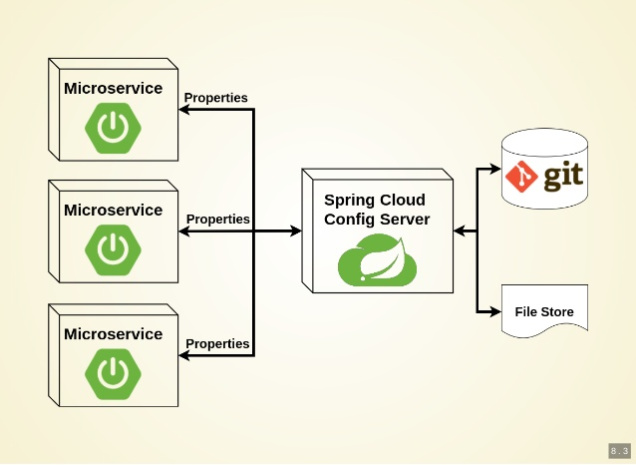
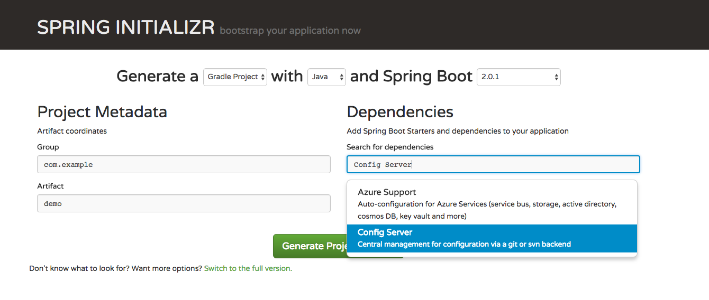

## O problema existente hoje...

Bom, primeiramente posso dizer que pensei nesse tema por já ter presenciado, algumas vezes, problemas em ambiente de produção, devido a configurações com **valores incorretos** ou mesmo **falta** delas por esquecimento.

Agora imagine isso ocorrendo no final de um deploy no ambiente de produção, e pior, com os arquivos de configurações (no caso de aplicações Java, normalmente arquivos *properties*) dentro da aplicação. Um novo deploy teria que ser feito em N máquinas. Caso o arquivo de configurações estivesse fora da aplicação, externalizado, o mesmo teria que ser alterado em todas as máquinas, exigiindo um *restart* das aplicações, ou um novo *deploy* teria que ser executado.

Mas não apenas isso: a configuração poderia ser algum parâmetro relacionado ao negócio, como por exemplo, um valor X utilizado em alguma operação, e que repentinamente teria que ser mudado e novamente não seria algo simples.

Pensando em resolver esse problema, eis que surge o Spring Cloud Config. A idéia dele é simples. Um repositório de configurações centralizado, que pode utilizar o *git* para versionamento de arquivos (que podem estar em serviços como GitHub ou GitLab, ou simplesmente arquivos locais), e que, quando o conteúdo do arquivo for modificado e versionado com um *commit/push*, os mesmos fossem alterados dinamicamente (através de uma URI HTTP POST) na minha aplicação sem *restart* ou mesmo *deploy* em todas as máquinas.

## Como funciona de forma geral

Abaixo a imagem ilustra de forma geral como o Spring Cloud Config funciona.



Inicialmente temos o Config Server, que basicamente lê as configurações contidas em algum lugar, seja um arquivo (gerenciado pelo *git*, podendo estar armazenado em algum serviço como GitHub ou GitLab, mas não obrigatoriamente) e as disponibiliza para os microserviços ou outros tipos de aplicações. Após qualquer mudança feita em um desses arquivos (*commit*), as novas configurações estarão automaticamente disponíveis para aplicações clientes (microserviços). Porém, para que o microserviço de fato use essa alteração sem *restart* é necesssário fazer uma chamada *http post* como veremos mais a frente.

## Vamos ao que interesse, ou seja, código

Chega de falatório e vamos ao código.

Primeiramente crie seu repositório (no exemplo vou utilizar o GitHub para hospedagem), seguindo a seguinte regra. O nome do seu arquivo de configurações precisa
coincidir com o nome da aplicação cliente, definido no arquivo *bootstrap.properties* pela propriedade “spring.application.name”.
Por exemplo:

```properties
spring.application.name=hello-world
```

Nesse exemplo, meu arquivo irá chamar-se hello-world.properties.

---

## Criando o Config Server

Uma vez criado o repositório, precisamos criar uma aplicação Spring Boot que será o Config Server.

### Usando o Spring Initializr

O ideal é que o Config Server seja um projeto Spring Boot independente de todas as outras aplicações existentes, visto que ele será responsável por gerenciar a configurações de todas elas.

Caso use o [Spring INITIALIZR](https://start.spring.io/) para criar um novo projeto Spring, basta adicionar a opção **Config Server** que ele
irá gerar o projeto já configurado.



### Adicionando manualmente em um projeto Spring já existente

Caso opte por essa segunda opção, basta adicionar as seguintes dependências.

No Maven

```xml
   <dependencies>
       <dependency>
           <groupId>org.springframework.cloud</groupId>
           <artifactId>spring-cloud-config-server</artifactId>
       </dependency>
   </dependencies>

   <dependencyManagement>
       <dependencies>
           <dependency>
               <groupId>org.springframework.cloud</groupId>
               <artifactId>spring-cloud-dependencies</artifactId>
               <version>Finchley.M8</version>
               <type>pom</type>
               <scope>import</scope>
           </dependency>
       </dependencies>
   </dependencyManagement>

   ...
   <repositories>
       <repository>
           <id>spring-milestones</id>
           <name>Spring Milestones</name>
           <url>https://repo.spring.io/libs-milestone</url>
           <snapshots>
               <enabled>false</enabled>
           </snapshots>
       </repository>
   </repositories>
```

No Gradle

```groovy
dependencies {
   compile('org.springframework.cloud:spring-cloud-config-server')
}

dependencyManagement {
   imports {
       mavenBom "org.springframework.cloud:spring-cloud-dependencies:Finchley.M8"
   }
}

repositories {
   maven {
       url 'https://repo.spring.io/libs-milestone'
   }
}
```

Uma vez configurado as dependências, vamos criar o *config server*. Basta adicionar **@EnableConfigServer** em uma aplicação Spring Boot e pronto: um servidor de configurações será criado.

```java
@EnableConfigServer
@SpringBootApplication
public class ConfigServiceApplication {

    public static void main(String[] args) {
        SpringApplication.run(ConfigServiceApplication.class, args);
    }
}
```

Feito isso, precisamos configurar onde o *back-end* de configurações que será utilizado. No nosso exemplo, utilizei o GitHub, e o local do repositório deve estar configurado da seguinte forma:

```properties
spring.cloud.config.server.git.uri=https://github.com/denis-schimidt/dynamic-configs
```

Dessa forma, nosso servidor estará pronto para obter os arquivos de propriedades a partir da URL do repostório, e a cada *commit* e *push* realizado, automaticamente detectará isso e disponibilizará para as aplicações clientes.

Nesse momento, se uma aplicação cliente fizesse *restart*, ela já teria suas configurações atualizados. Porém a idéia é poder fazer isso sem *restart*, como veremos mais a frente.

Outro ponto importante é que as configurações obtidas a partir do servidor sobrescrevem todos as configurações definidas na aplicação cliente (application.properties).

É possível verificar seus properties carregados via *http get* (browser ou curl) pela URI ```http://localhost:<port>/<client-aplication-name>/<profile>```, como mostrado abaixo:


## Configurando o Config Server no client

Assim, finalmente chegamos a aplicação cliente, que utiliza as configurações. A diferença para as dependências do servidor é o artefato *spring-cloud-config-client* (ao invés do *spring-cloud-config-server*).

A anotação **@RefreshScope** propicia essa atualização. No exemplo abaixo o valor na propriedade “message” será recuperado a partir do servidor de configurações, e caso a propriedade não exista (ou o servidor não esteja disponível), o valor “Hello default” será usado.

```java
@RefreshScope
@RestController
public class HelloWorldController {
    @Value("${message:Hello default}")
    private String message;

    @GetMapping("/message")
    String getMessage() {
        return this.message;
    }
}
```

Para atualizarmos o cliente sem *restart* usamos o seguinte comando e ele responderá quais configurações foram atualizados, como exibido abaixo:

```bash
### Chamada http post ao Actuator da aplicação cliente
curl -X POST localhost:8080/<client-application-context>/actuator/refresh -H "Content-Type: application/json"
```

```bash
### Resposta da chamada hhtp post, indicando o que foi atualizado
["config.client.version", "message"]
```

Uma vez feito isso, basta dar o famoso F5 na página da aplicação cliente e tudo estará atualizado dinamicamente.

## Testes Integrados

Podemos, para finalizar, garantirmos com testes de integração (usando as classes disponíveis no Spring Boot), o funcionamento das configurações no cliente, como no exemplo a seguir. No teste, inicialmente usamos um valor previamente definido na aplicação cliente e através do *TestPropertyValues*, *ConfigurableEnviroment* e *ContextRefresher* é possível validar se o valor de fato está sendo atualizado.

```java
@RunWith(SpringRunner.class)
@SpringBootTest
public class ConfigClientApplicationTest {

    @Autowired
    private ConfigurableEnvironment environment;

    @Autowired
    private HelloWorldController controller;

    @Autowired
    private ContextRefresher refresher;

    @Test
    public void contextLoads() {
        assertThat(controller.getMessage()).isNotEqualTo("Hello test");
        TestPropertyValues
            .of("message:Hello test")
            .applyTo(environment);
        assertThat(controller.getMessage()).isNotEqualTo("Hello test");
        refresher.refresh();
        assertThat(controller.getMessage()).isEqualTo("Hello test");
    }

}
```

## Conclusão

Podemos ver nesse post, de forma geral, como termos configurações centralizadas usando o Spring Cloud Config, em conjunto com aplicações Spring Boot e seus benefícios.

Caso queiram ver o código, o mesmo está disponibilizado no github [spring-cloud-config](https://github.com/denis-schimidt/spring-cloud-config/) e suas
[configurações](https://github.com/denis-schimidt/dynamic-configs).

Bom amigos, é isso. Caso tenham dúvidas, sugestões estamos a disposição. Até a próxima!
